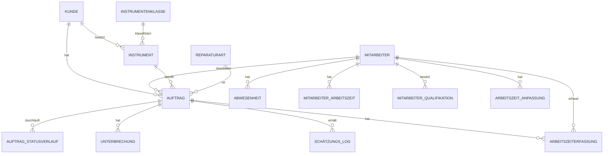

# Datenmodell: Auftragsmanagement Reparaturwerkstatt für Musikinstrumente

Dieses Dokument beschreibt das Datenmodell für Version 1 (regelbasierte Terminschätzung) und legt gleichzeitig die Grundlage für Version 2 (datengetriebene Schätzung mittels ML), ohne dass später ein Umbau nötig wird.

---

## 1. Grundprinzip

Jeder Statuswechsel eines Auftrags wird als eigener Datensatz mit Zeitstempel gespeichert (nicht nur als aktuelles Statusfeld). Nur so lassen sich später echte Bearbeitungszeiten pro Instrumentenklasse und Reparaturart auswerten.

---

## 2. Tabellen

### 2.1 `kunde`

| Feld | Typ | Beschreibung |
|---|---|---|
| id | UUID / SERIAL | Primärschlüssel |
| kundennummer | VARCHAR, UNIQUE | Für das Kunden-Dashboard sichtbar (siehe Hinweis zu Sicherheit unten) |
| name | VARCHAR | |
| email | VARCHAR | Optional, für Statusbenachrichtigungen |
| telefon | VARCHAR | Optional |
| erstellt_am | TIMESTAMP | |

**Sicherheitshinweis:** Zum sicheren Dashboard-Zugriff wird zusätzlich zur Auftragsnummer ein Zugriffstoken benötigt — Details siehe Abschnitt 6 "Kundenauthentifizierung".

---

### 2.2 `mitarbeiter`

| Feld | Typ | Beschreibung |
|---|---|---|
| id | UUID / SERIAL | Primärschlüssel |
| name | VARCHAR | |
| rolle | VARCHAR | Fachliche Rolle, z. B. Geigenbauer, Blechblas-Techniker |
| systemrolle | ENUM | `mitarbeiter` / `werkstattleiter` / `admin` — steuert die Berechtigungen in der Software (siehe Abschnitt 7) |
| email | VARCHAR | Für Login |
| passwort_hash | VARCHAR | Niemals Klartext speichern |
| aktiv | BOOLEAN | Für ausgeschiedene Mitarbeiter — Datensatz wird deaktiviert, nicht gelöscht, damit die Auftragshistorie erhalten bleibt |
| erstellt_am | TIMESTAMP | |
| deaktiviert_am | TIMESTAMP | NULL solange aktiv |

---

### 2.3 `abwesenheit`

Für Urlaub, Krankheit, Feiertage — wichtig sowohl für die interne Kapazitätsplanung als auch später als Modell-Feature ("Saisonalität").

| Feld | Typ | Beschreibung |
|---|---|---|
| id | UUID / SERIAL | Primärschlüssel |
| mitarbeiter_id | FK → mitarbeiter | NULL = betrifft ganze Werkstatt (z. B. Betriebsurlaub) |
| von_datum | DATE | |
| bis_datum | DATE | |
| typ | VARCHAR | Urlaub / Krankheit / Feiertag / Betriebsschließung / Schulung / Reduzierte Stunden |
| reduzierte_stunden | DECIMAL | NULL = ganztägig abwesend im angegebenen Zeitraum. Ansonsten: nur teilweise reduzierte Verfügbarkeit im Zeitraum (z. B. "diese Woche nur 20 statt 35 Stunden" wegen Arztterminen o. Ä.), ohne eine eigene Tabelle dafür zu brauchen |

---

### 2.4 `instrumentenklasse`

Strukturierte Kategorie statt Freitext — Pflicht für spätere Auswertbarkeit.

| Feld | Typ | Beschreibung |
|---|---|---|
| id | UUID / SERIAL | Primärschlüssel |
| bezeichnung | VARCHAR | z. B. "Violine", "Trompete", "Klarinette", "Klavier" |
| oberkategorie | VARCHAR | z. B. "Streichinstrument", "Blechblas", "Holzblas", "Tasteninstrument" |

---

### 2.5 `instrument`

Erfasst das konkrete Instrument eines Kunden — getrennt von der Klasse (2.4), damit Hersteller, Typenbezeichnung und Baujahr gespeichert werden können. Ein Kunde kann mehrere Instrumente haben, ein Instrument kann über die Zeit mehrere Aufträge durchlaufen.

| Feld | Typ | Beschreibung |
|---|---|---|
| id | UUID / SERIAL | Primärschlüssel |
| kunde_id | FK → kunde | Eigentümer des Instruments |
| instrumentenklasse_id | FK → instrumentenklasse | z. B. "Violine" |
| hersteller | VARCHAR | z. B. "Yamaha", "Stainer", Werkstattname bei Manufakturinstrumenten |
| typenbezeichnung | VARCHAR | Modell-/Typbezeichnung, z. B. "YFL-222" |
| baujahr | INT | Optional, falls bekannt/schätzbar |
| seriennummer | VARCHAR | Optional, hilfreich zur eindeutigen Identifikation bei Folgeaufträgen |
| notizen | TEXT | z. B. Besonderheiten, bekannte Vorschäden |

**Nutzen fürs spätere Modell (Stufe 2):** Hersteller/Baujahr können als zusätzliche Merkmale einfließen — ältere oder bestimmte Hersteller-Instrumente benötigen bei manchen Reparaturarten erfahrungsgemäß mehr Zeit (z. B. Ersatzteilbeschaffung bei alten oder seltenen Modellen).

---

### 2.6 `reparaturart`

| Feld | Typ | Beschreibung |
|---|---|---|
| id | UUID / SERIAL | Primärschlüssel |
| bezeichnung | VARCHAR | z. B. "Saitenwechsel", "Ventil-Überholung", "Rissreparatur Decke" |
| standard_komplexität | INT (1–5) | Vorbelegung, kann pro Auftrag überschrieben werden |

---

### 2.7 `auftrag`

Die zentrale Tabelle.

| Feld | Typ | Beschreibung |
|---|---|---|
| id | UUID / SERIAL | Primärschlüssel |
| auftragsnummer | VARCHAR, UNIQUE | Für Kunden sichtbar, dient als Referenz — allein nicht ausreichend für den Dashboard-Zugriff (siehe Abschnitt 6) |
| zugriffstoken | VARCHAR, UNIQUE | Zufällig generierter Code (z. B. 10–12 alphanumerische Zeichen), zusammen mit der Auftragsnummer der einzige Schlüssel zum Kunden-Dashboard. Wird bei Auftragsannahme erzeugt und auf dem Abgabebeleg/als QR-Code ausgegeben. Muss kryptografisch zufällig sein, nicht aus anderen Feldern ableitbar |
| kunde_id | FK → kunde | |
| instrument_id | FK → instrument | Ersetzt die direkte Referenz auf `instrumentenklasse` — die Klasse ergibt sich über den Join `instrument.instrumentenklasse_id` |
| reparaturart_id | FK → reparaturart | Bei mehreren Arbeiten am selben Instrument: separate Aufträge oder Teilaufgaben-Tabelle |
| zugewiesener_mitarbeiter_id | FK → mitarbeiter | Kann initial NULL sein (noch nicht zugewiesen) |
| priorität | ENUM (`normal` / `hoch`) | Manuell durch Werkstattleiter/Admin setzbar, z. B. bei Eilaufträgen oder Kulanzfällen. Fließt in die Sortierung der Mitarbeiter- und Werkstattleiter-Dashboards ein (siehe Abschnitt 9) |
| komplexität | INT (1–5) | Vom Mitarbeiter bei Anlage geschätzt |
| status_aktuell | VARCHAR | Redundant zu Performance-Zwecken — Quelle der Wahrheit ist `auftrag_statusverlauf` |
| erstellt_am | TIMESTAMP | |
| geschätztes_fertigstellungsdatum | DATE | Ergebnis der Berechnung (Stufe 1 oder 2) |
| geschätzte_bandbreite_von | DATE | z. B. für Anzeige "zwischen dem 12. und 16.10." |
| geschätzte_bandbreite_bis | DATE | |
| geschätzte_arbeitsstunden | DECIMAL | Geschätzter reiner Arbeitsaufwand in Stunden (nicht Kalenderdauer) — Grundlage für die Kapazitätsplanung (Abschnitt 9.9). Wird wie die Terminschätzung selbst aus historischen `arbeitszeiterfassung`-Werten vergleichbarer Kombinationen aus Instrumentenklasse/Reparaturart berechnet |
| tatsächliches_fertigstellungsdatum | DATE | NULL bis abgeschlossen — **das ist dein Trainingslabel für Stufe 2** |
| notizen | TEXT | Freitext für interne Zwecke |

---

### 2.8 `auftrag_statusverlauf`

Kernstück für spätere Auswertung — jeder Wechsel wird protokolliert, nichts wird überschrieben.

| Feld | Typ | Beschreibung |
|---|---|---|
| id | UUID / SERIAL | Primärschlüssel |
| auftrag_id | FK → auftrag | |
| status | VARCHAR | z. B. "Angenommen", "In Bearbeitung", "Wartet auf Ersatzteil", "Qualitätsprüfung", "Fertig", "Abgeholt" |
| geändert_am | TIMESTAMP | |
| geändert_von_mitarbeiter_id | FK → mitarbeiter | |
| kommentar | TEXT | Optional |

---

### 2.9 `unterbrechung`

Erfasst Gründe für Verzögerungen — wichtig, damit das spätere Modell "hausgemachte" Verzögerungen (Ersatzteillieferzeit) von echter Bearbeitungsdauer unterscheiden kann.

| Feld | Typ | Beschreibung |
|---|---|---|
| id | UUID / SERIAL | Primärschlüssel |
| auftrag_id | FK → auftrag | |
| grund | VARCHAR | z. B. "Ersatzteil bestellt", "Rückfrage beim Kunden", "Zusatzschaden entdeckt" |
| von_datum | TIMESTAMP | |
| bis_datum | TIMESTAMP | NULL solange ungelöst |

---

### 2.10 `schätzungs_log` (für Stufe 2 vorbereitet)

Protokolliert jede automatische Schätzung — damit du später prüfen kannst, wie gut das Modell tatsächlich war (Ist- vs. Prognosewert).

| Feld | Typ | Beschreibung |
|---|---|---|
| id | UUID / SERIAL | Primärschlüssel |
| auftrag_id | FK → auftrag | |
| berechnet_am | TIMESTAMP | |
| methode | VARCHAR | "regelbasiert" oder "ml_modell_v1" etc. |
| geschätztes_datum | DATE | |
| eingabefaktoren | JSONB | Snapshot der Faktoren zum Berechnungszeitpunkt (Auftragsvolumen, verfügbare Mitarbeiter, Saison etc.) — wichtig für Nachvollziehbarkeit und späteres Modell-Debugging |

---

### 2.11 `arbeitszeiterfassung`

Erfasst die tatsächlich aufgewendete Arbeitszeit je Auftrag — Grundlage für die Abrechnung und, unabhängig davon, ein präziseres Merkmal für die Terminschätzung als die reine Kalenderdauer: Ein Auftrag kann kalendarisch zwei Wochen dauern, aber nur drei Stunden reine Werkstattzeit umfassen (Rest ist Warten auf Ersatzteile, siehe `unterbrechung`). Für Stufe 2 ist die reine Arbeitszeit daher oft das aussagekräftigere Trainingsmerkmal als das Enddatum allein.

| Feld | Typ | Beschreibung |
|---|---|---|
| id | UUID / SERIAL | Primärschlüssel |
| auftrag_id | FK → auftrag | |
| mitarbeiter_id | FK → mitarbeiter | Falls mehrere Mitarbeiter am selben Auftrag gearbeitet haben, entsteht je Mitarbeiter ein eigener Eintrag |
| dauer_minuten | INT | Vom Mitarbeiter beim Abschluss eingegeben |
| erfasst_am | TIMESTAMP | Zeitpunkt der Eingabe (i. d. R. beim Setzen des Status "Fertig") |
| kommentar | TEXT | Optional, z. B. "davon 20 Min. Wartezeit auf Kleber-Trocknung" |

**Auslösender Workflow:** Setzt ein Mitarbeiter den Auftragsstatus auf "Fertig", fordert die Oberfläche verpflichtend die Eingabe der aufgewendeten Arbeitszeit an, bevor der Statuswechsel abgeschlossen wird (siehe Abschnitt 9.8). Bei mehreren Bearbeitungssitzungen (z. B. Unterbrechung durch Ersatzteilbestellung, danach Weiterarbeit) können auch mehrere Einträge über die Laufzeit des Auftrags entstehen — die Summe aller `dauer_minuten` je Auftrag ergibt die gesamte Bearbeitungszeit.

---

### 2.12 `mitarbeiter_arbeitszeit`

Vertraglich vereinbarte Wochenarbeitsstunden je Mitarbeiter — Grundlage der Kapazitätsplanung (Abschnitt 9.9). Als eigene Tabelle mit Gültigkeitszeitraum angelegt statt als einfaches Feld in `mitarbeiter`, damit Änderungen (z. B. Aufstockung von Teilzeit) nachvollziehbar bleiben und rückwirkende Auswertungen weiterhin den zum jeweiligen Zeitpunkt gültigen Wert verwenden.

| Feld | Typ | Beschreibung |
|---|---|---|
| id | UUID / SERIAL | Primärschlüssel |
| mitarbeiter_id | FK → mitarbeiter | |
| wochenstunden | DECIMAL | z. B. 35,0 |
| gültig_ab | DATE | |
| gültig_bis | DATE | NULL = aktuell gültig |
| geändert_von_mitarbeiter_id | FK → mitarbeiter | Wer die Änderung vorgenommen hat (Admin) |
| geändert_am | TIMESTAMP | |

**Pflege:** Ausschließlich über den Administrationsbereich durch die Systemrolle `admin` (siehe Berechtigungsmatrix, Abschnitt 7.2) — ein neuer Eintrag mit neuem `gültig_ab`-Datum schließt automatisch den vorherigen Eintrag ab (`gültig_bis` = Tag davor), statt den alten Wert zu überschreiben.

---

### 2.13 `mitarbeiter_qualifikation`

Hält fest, wofür ein Mitarbeiter durch Ausbildung oder Schulung qualifiziert ist. Wird anfangs von der Berechnungslogik noch nicht ausgewertet, ist aber ohne Mehraufwand mitgepflegt und später direkt nutzbar — z. B. um bei der Auftragszuweisung nur qualifizierte Mitarbeiter vorzuschlagen oder als zusätzliches Merkmal für die Stufe-2-Schätzung (erfahrene vs. neu qualifizierte Mitarbeiter brauchen bei derselben Reparaturart oft unterschiedlich lang).

| Feld | Typ | Beschreibung |
|---|---|---|
| id | UUID / SERIAL | Primärschlüssel |
| mitarbeiter_id | FK → mitarbeiter | |
| reparaturart_id | FK → reparaturart | Optional — wofür die Qualifikation gilt |
| instrumentenklasse_id | FK → instrumentenklasse | Optional — alternativ oder zusätzlich auf Instrumentenklasse bezogen |
| bezeichnung | VARCHAR | z. B. "Zertifikat E-Gitarren-Elektronik", "Meisterkurs Blechblasinstrumente" |
| erworben_am | DATE | |
| gültig_bis | DATE | Optional, für Zertifikate mit Ablaufdatum — NULL = unbefristet |

**Zusammenhang mit Abwesenheit:** Die Schulung selbst (der Zeitraum, in dem der Mitarbeiter nicht für Reparaturen verfügbar ist) wird über `abwesenheit` mit `typ = "Schulung"` erfasst (siehe 2.3) — diese Tabelle hält nur das *Ergebnis* der Schulung fest, nicht den Abwesenheitszeitraum selbst.

---

### 2.14 `arbeitszeit_anpassung`

Bildet Gleitzeit-Ausgleich ab, ohne ein vollständiges Zeiterfassungssystem (Kommen/Gehen-Stempeluhr) bauen zu müssen — das wäre ein eigenes Thema jenseits des Auftragsmanagements. Stattdessen werden nur die Wochen-Abweichungen von der Regelarbeitszeit erfasst.

| Feld | Typ | Beschreibung |
|---|---|---|
| id | UUID / SERIAL | Primärschlüssel |
| mitarbeiter_id | FK → mitarbeiter | |
| woche_start_datum | DATE | Montag der betroffenen Woche |
| anpassung_stunden | DECIMAL | Positiv = mehr Kapazität diese Woche (z. B. `+5`), negativ = Ausgleichstag/-stunden (z. B. `-8`) |
| grund | VARCHAR | z. B. "Gleitzeitausgleich", "Vorarbeit vor Betriebsurlaub" |
| erfasst_von_mitarbeiter_id | FK → mitarbeiter | |
| erfasst_am | TIMESTAMP | |

**Aktueller Gleitzeitsaldo** eines Mitarbeiters ergibt sich bei Bedarf durch Summierung aller bisherigen Einträge — muss nicht separat als eigener Wert gepflegt werden. Wird anfangs von der Kapazitätsberechnung (Abschnitt 8) noch nicht zwingend einbezogen, lässt sich aber später als zusätzlicher Term in die Formel aufnehmen, ohne die Struktur zu ändern.

---

## 3. Beziehungsdiagramm (vereinfacht)



---

## 4. Stufe 1: Regelbasierte Berechnungslogik (Beispiel)

```
geschätzte_dauer_tage =
    durchschnitt(bisherige_ist_dauer WHERE instrumentenklasse = X AND reparaturart = Y)
    * komplexitätsfaktor(auftrag.komplexität)
    + warteschlangen_aufschlag(zugewiesener_mitarbeiter, aktuelles_auftragsvolumen)
    + abwesenheits_aufschlag(zugewiesener_mitarbeiter, abwesenheit im Zeitraum)

geschätztes_fertigstellungsdatum = erstellt_am + geschätzte_dauer_tage (Arbeitstage, keine Wochenenden/Feiertage)
```

Für Instrumentenklasse/Reparaturart-Kombinationen ohne historische Daten: Fallback auf einen manuell hinterlegten Startwert pro `reparaturart.standard_komplexität`.

**Hinweis:** Sobald `arbeitszeiterfassung`-Daten vorliegen, kann `bisherige_ist_dauer` wahlweise auf Basis der Kalenderdauer oder der reinen Arbeitszeit berechnet werden — Letztere liefert genauere Durchschnittswerte, da sie nicht durch Wartezeiten auf Ersatzteile verzerrt wird.

---

## 5. Übergang zu Stufe 2 (ML-Modell)

Sobald ausreichend abgeschlossene Aufträge vorliegen (Richtwert: mind. 200–300, besser mehr, pro relevanter Kombination aus Instrumentenklasse/Reparaturart mindestens ~20–30):

- **Zielgröße (Label):** wahlweise `tatsächliches_fertigstellungsdatum − erstellt_am` (Kalenderdauer, ggf. abzüglich `unterbrechung`-Zeiten) oder die Summe der `arbeitszeiterfassung.dauer_minuten` je Auftrag (reine Bearbeitungszeit) — Letztere ist präziser, da sie Wartezeiten auf Ersatzteile o. ä. automatisch ausklammert
- **Merkmale (Features):** Instrumentenklasse, Hersteller, Baujahr, Reparaturart, Komplexität, Mitarbeiter, aktuelles Auftragsvolumen zum Erstellzeitpunkt, Monat/Saison, Anzahl gleichzeitig abwesender Mitarbeiter, historische durchschnittliche Arbeitszeit für vergleichbare Kombinationen aus Instrumentenklasse/Reparaturart
- **Modelltyp:** Gradient Boosting (z. B. XGBoost/LightGBM) oder einfache multiple Regression — beides deutlich transparenter als neuronale Netze und für diese Datenmenge völlig ausreichend
- **Ausgabe:** idealerweise ein Vorhersageintervall statt eines Einzelwerts (z. B. 10./90. Perzentil), damit das Kunden-Dashboard eine Bandbreite statt eines Fixdatums anzeigen kann
- **Re-Training:** periodisch (z. B. monatlich) auf Basis aller neu abgeschlossenen Aufträge

Weil `schätzungs_log` von Anfang an mitläuft, kannst du beim Wechsel zu Stufe 2 direkt vergleichen: "Wie gut hätte das Modell in der Vergangenheit vorhergesagt?" (Backtesting), bevor es live geschaltet wird.

---

## 6. Kundenauthentifizierung (Dashboard-Zugriff ohne Login)

Ziel: Kunden sollen ihren Auftragsstatus abrufen können, ohne ein Benutzerkonto anzulegen oder sich mit Passwort anzumelden — die Hürde muss aber trotzdem hoch genug sein, dass niemand fremde Auftragsdaten einsehen kann.

### 6.1 Warum Postleitzahl als zweiter Faktor ungeeignet ist

- **Zu kleiner Wertebereich:** In Deutschland gibt es nur ca. 8.200 Postleitzahlen — automatisiertes Durchprobieren (Brute-Force) ist ohne große Hürden möglich
- **Kein echtes Geheimnis:** Nachbarn, Kollegen oder Familienmitglieder kennen häufig dieselbe PLZ
- **Nicht änderbar:** Einmal in Verbindung mit einem Namen bekannt (z. B. aus einer anderen Datenpanne), bleibt sie dauerhaft schwach

Die Postleitzahl erhöht die Sicherheit gegenüber einer alleinigen Auftragsnummer zwar etwas, ersetzt aber kein echtes Geheimnis.

### 6.2 Gewählter Ansatz: Zugriffstoken

Auftragsnummer + `zugriffstoken` (siehe 2.7) bilden gemeinsam den Schlüssel zum Dashboard:

- Der Token wird bei Auftragsannahme **kryptografisch zufällig** erzeugt (nicht aus Datum, Auftragsnummer o. ä. ableitbar)
- Er wird auf dem Abgabebeleg gedruckt oder als QR-Code mitgegeben — ähnlich der Sendungsverfolgung bei Paketdiensten, ein Muster, das Kunden bereits kennen
- Die Kundennummer wird für den Dashboard-Zugriff nicht mehr benötigt, da Auftragsnummer + Token bereits ausreichend eindeutig und sicher sind

### 6.3 Alternative/Ergänzung: Magic Link per E-Mail

Falls ohnehin E-Mail-Adressen erfasst werden (z. B. für Fertigstellungsbenachrichtigungen), ist das die sicherste Variante:

- Kunde gibt nur die Auftragsnummer ein
- System sendet einen zeitlich begrenzten Link an die hinterlegte E-Mail-Adresse
- Kein Code zum Abtippen nötig, dafür Abhängigkeit vom Mailversand (SMTP) und vom Zugriff auf die Mails im jeweiligen Moment

Für die erste Version empfiehlt sich der Zugriffstoken (Abschnitt 6.2) als einfachere, sofort umsetzbare Lösung; der Magic-Link-Ansatz lässt sich später ergänzen, ohne das Datenmodell zu ändern.

### 6.4 Zusätzliche Schutzmaßnahmen (unabhängig vom gewählten Verfahren)

- **Rate Limiting:** z. B. nach 5 Fehlversuchen pro IP-Adresse kurzzeitig sperren, um automatisiertes Durchprobieren zu verhindern
- **Keine differenzierte Fehlermeldung:** "Auftragsnummer oder Code ungültig" statt anzuzeigen, welcher Teil falsch war — sonst lässt sich die Kombination stückweise erraten
- **HTTPS zwingend**, damit Auftragsnummer und Token nicht im Klartext übertragen werden
- **Datenminimierung im Dashboard:** nur Status und voraussichtlicher Fertigstellungstermin anzeigen, keine sensiblen Zusatzdaten wie vollständige Adresse oder Telefonnummer

---

## 7. Administrationsbereich

Der Administrationsbereich ist kein separates System, sondern ein zusätzlicher Bereich der internen Oberfläche, der nur für die Systemrollen `werkstattleiter` und `admin` sichtbar ist (siehe `mitarbeiter.systemrolle`, Abschnitt 2.2). Normale Mitarbeiter sehen ihn nicht.

### 7.1 Warum zwei unterschiedliche Rollen statt nur "Admin"?

In der Praxis sind das zwei unterschiedliche Verantwortungsbereiche, die nicht zwingend dieselbe Person betreffen müssen (z. B. wenn ein externer Dienstleister die Software technisch betreut, aber der Werkstattleiter den Tagesbetrieb steuert):

- **Werkstattleiter:** verantwortet den **operativen Betrieb** — wer arbeitet woran, wer ist wann abwesend, wie ist die Auslastung
- **Admin:** verantwortet die **technische/strukturelle Verwaltung** des Systems — welche Mitarbeiter-Accounts es gibt, welche Kategorien/Stammdaten zur Verfügung stehen

Ein Admin hat automatisch auch alle Rechte eines Werkstattleiters (Rollen sind kumulativ), aber nicht umgekehrt.

### 7.2 Berechtigungsmatrix

| Funktion | Mitarbeiter | Werkstattleiter | Admin |
|---|---|---|---|
| Eigene zugewiesene Aufträge einsehen/bearbeiten | ✅ | ✅ | ✅ |
| Alle Aufträge werkstattweit einsehen | ❌ | ✅ | ✅ |
| Aufträge einem Mitarbeiter zuweisen/umverteilen | ❌ | ✅ | ✅ |
| Geschätztes Fertigstellungsdatum manuell korrigieren | ❌ | ✅ | ✅ |
| Abwesenheiten (Urlaub/Krankheit) für Mitarbeiter eintragen | ❌ | ✅ | ✅ |
| Betriebsweite Abwesenheit eintragen (z. B. Betriebsurlaub) | ❌ | ✅ | ✅ |
| Gleitzeit-Anpassung erfassen | ❌ | ✅ | ✅ |
| Mitarbeiter-Qualifikationen pflegen | ❌ | ❌ | ✅ |
| Wochenarbeitsstunden je Mitarbeiter festlegen | ❌ | ❌ | ✅ |
| Instrumentenklassen pflegen | ❌ | ❌ | ✅ |
| Reparaturarten + Standard-Komplexität pflegen | ❌ | ❌ | ✅ |
| Neue Mitarbeiter-Accounts anlegen | ❌ | ❌ | ✅ |
| Mitarbeiter deaktivieren | ❌ | ❌ | ✅ |
| Systemrollen vergeben (wer ist Werkstattleiter/Admin) | ❌ | ❌ | ✅ |
| Parameter der Stufe-1-Berechnungslogik anpassen (z. B. Komplexitätsfaktoren) | ❌ | ❌ | ✅ |

In einer kleinen Werkstatt ist es üblich, dass der Werkstattleiter zusätzlich als Admin eingerichtet wird — die Trennung kostet dich beim Bauen kaum Mehraufwand (es ist im Kern eine zusätzliche Prüfung "ist systemrolle = admin?"), gibt dir aber die Flexibilität, es später sauber zu trennen, falls z. B. ein externer IT-Dienstleister die technische Pflege übernimmt.

### 7.3 Neue Tabelle: `system_ereignis_log`

Empfehlenswert, sobald mehrere Personen administrative Rechte haben — protokolliert sicherheitsrelevante Änderungen nachvollziehbar.

| Feld | Typ | Beschreibung |
|---|---|---|
| id | UUID / SERIAL | Primärschlüssel |
| ausgeführt_von_mitarbeiter_id | FK → mitarbeiter | |
| aktion | VARCHAR | z. B. "mitarbeiter_angelegt", "mitarbeiter_deaktiviert", "reparaturart_geändert", "rolle_geändert" |
| betroffene_entität | VARCHAR | z. B. "mitarbeiter", "reparaturart" |
| betroffene_id | UUID | ID des betroffenen Datensatzes |
| details | JSONB | Was genau geändert wurde (alter/neuer Wert) |
| zeitpunkt | TIMESTAMP | |

### 7.4 Funktionsübersicht des Administrationsbereichs

- **Mitarbeiterverwaltung** (nur Admin): Accounts anlegen, Systemrolle zuweisen, deaktivieren (nie hart löschen — sonst verwaisen vergangene Aufträge), Wochenarbeitsstunden festlegen (2.12), Qualifikationen pflegen (2.13)
- **Abwesenheitskalender** (Werkstattleiter + Admin): idealerweise als Kalenderansicht pro Mitarbeiter und für die gesamte Werkstatt, direkt verknüpft mit der `abwesenheit`-Tabelle (2.3, inkl. Typ "Schulung" und reduzierter Stunden) und damit unmittelbar wirksam für die Terminschätzung (Stufe 1) sowie die Kapazitätsplanung (Abschnitt 8)
- **Gleitzeit-Anpassungen** (Werkstattleiter + Admin): einzelne Wochen-Abweichungen erfassen (2.14), operativ genutzt, ohne vollständige Zeiterfassung
- **Stammdatenpflege** (nur Admin): Instrumentenklassen (2.4) und Reparaturarten (2.6) inkl. Standardkomplexität
- **Werkstattübersicht** (Werkstattleiter + Admin): alle laufenden Aufträge, Auslastung pro Mitarbeiter, überfällige/kritische Aufträge hervorgehoben
- **Änderungsprotokoll** (nur Admin einsehbar): Anzeige des `system_ereignis_log`

---

## 8. Kapazitätsplanung der Mitarbeiter

### 8.1 Grundprinzip

Statt einer detaillierten Tages-/Stundenplanung (wie sie klassische Schichtplanungs-Software macht) reicht für eine kleine Werkstatt ein einfacheres, wochenbasiertes Kapazitätsmodell, wie es Ressourcenplanungs-Tools wie Float, Resource Guru oder die "Workload"-Ansichten in Asana/monday.com verwenden: Jeder Mitarbeiter hat eine wöchentliche Kapazität in Stunden, davon wird abgezogen, was bereits durch Abwesenheiten und zugewiesene offene Aufträge gebunden ist. Das Ergebnis ist die freie Kapazität für neue Aufträge — ganz ohne Tages- oder Uhrzeit-genaue Planung.

### 8.2 Berechnungsformel

```
verfügbare_stunden(mitarbeiter, woche) =
    wochenstunden                                    (aus mitarbeiter_arbeitszeit, 2.12)
    − abwesenheitsstunden in dieser Woche             (aus abwesenheit, 2.3 — ganztägig oder reduzierte_stunden)
    − Summe(geschätzte_arbeitsstunden aller zugewiesenen, noch offenen Aufträge)   (aus auftrag, 2.7)

auslastung_prozent = gebundene_stunden / wochenstunden * 100
```

Diese Berechnung läuft automatisch im Hintergrund und muss von niemandem manuell gepflegt werden — gepflegt werden nur die Grunddaten (Wochenstunden im Adminbereich, Abwesenheiten durch den Werkstattleiter, Aufträge durch Zuweisung).

**Spätere Erweiterung:** Sobald gewünscht, lässt sich die Formel um `± Summe(arbeitszeit_anpassung.anpassung_stunden)` für Gleitzeitausgleich (siehe 2.14) ergänzen, ohne die Grundstruktur zu ändern. Ebenso lässt sich `mitarbeiter_qualifikation` (2.13) später nutzen, um bei der Auftragszuweisung nur passend qualifizierte Mitarbeiter vorzuschlagen. Beide Tabellen sind bereits jetzt mitgepflegt, auch wenn die Berechnungslogik sie anfangs noch nicht auswertet — so entsteht kein Nachpflegeaufwand, wenn du sie später brauchst.

### 8.3 Warum keine feinere Tagesplanung nötig ist

Eine Reparaturwerkstatt hat in der Regel keine exakt terminierten Slots wie ein Frisör oder eine Arztpraxis — die Reihenfolge der Bearbeitung ergibt sich ohnehin aus Priorität und Auftragseingang (siehe Mitarbeiter-Dashboard, Abschnitt 9.4). Eine wochenweise Kapazitätsübersicht reicht daher aus, um zu erkennen: "Mitarbeiter X ist diese und nächste Woche schon voll ausgelastet, neue Aufträge besser an Mitarbeiter Y vergeben." Sollte sich später herausstellen, dass doch eine feinere Terminplanung nötig ist (z. B. bei Zusagen fester Abholtermine), lässt sich das Modell erweitern, ohne die Grundstruktur zu ändern.

---

## 9. UI/UX-Richtlinien

Diese Regeln gelten seitenübergreifend für die gesamte Software (internes Dashboard, Administrationsbereich, Kunden-Dashboard), damit ein konsistentes und vorhersehbares Verhalten entsteht — unabhängig davon, wer welchen Teil später baut oder erweitert.

### 9.1 Formulare & Eingabemasken

- **Keine Popups/modale Dialoge** für Dateneingabe — Formulare sind eigene Seiten oder fest eingebettete Bereiche, keine Overlays
- **Inline-Validierung:** Fehler (Pflichtfeld leer, falsches Format) werden direkt am betroffenen Feld angezeigt, nicht als Dialog oder Sammel-Fehlermeldung am Seitenende
- **Speichern-Bestätigung:** Nach erfolgreichem Speichern erhält der Nutzer eine sichtbare, aber nicht blockierende Bestätigung (z. B. eine kurze Erfolgsmeldung/Toast am Bildschirmrand), kein Popup, das weggeklickt werden muss
- **Warnung bei ungespeicherten Änderungen:** Verlässt der Nutzer eine Seite mit ungespeicherten Änderungen (Navigation, Schließen), erscheint eine Rückfrage, ob er wirklich verlassen möchte

### 9.2 Navigation

- **Startseiten-Link oben links:** Auf jeder Seite führt ein fest positioniertes Element oben links zurück zur jeweiligen Startseite (Mitarbeiter zur Mitarbeiter-Übersicht, Werkstattleiter/Admin zu deren Dashboard, Kunde zur Statusabfrage)
- **Breadcrumbs** auf tieferliegenden Seiten (z. B. Auftrag-Detail), damit klar ist, wo man sich befindet
- **Kein hartes Löschen:** Aufträge, Mitarbeiter und Stammdaten werden nie endgültig gelöscht, sondern archiviert/deaktiviert — ein versehentlicher Klick soll nichts unwiederbringlich zerstören

### 9.3 Statusdarstellung

- **Farbe + Symbol/Label kombiniert**, nie Farbe allein — wichtig für Lesbarkeit und Barrierefreiheit (z. B. Farbfehlsichtigkeit)
- **Feste, durchgängige Farbzuordnung** pro Status (z. B. Grau = Angenommen, Blau = In Bearbeitung, Orange = Wartet auf Ersatzteil, Grün = Fertig)
- **Überfällige Aufträge** (geschätztes Fertigstellungsdatum überschritten, noch nicht fertig) werden sofort optisch hervorgehoben, ohne dass man den Auftrag öffnen muss
- **Priorisierte Aufträge** (`priorität = hoch`, siehe 2.7) werden zusätzlich visuell markiert (z. B. Kennzeichnung/Icon in der Liste)

### 9.4 Mitarbeiter-Dashboard

- Übersicht der dem Mitarbeiter zugewiesenen aktuellen Aufträge
- Standard-Sortierung: zuerst nach `priorität` (hoch vor normal), innerhalb gleicher Priorität nach Auftragseingang (`erstellt_am`, älteste zuerst)
- Nutzer kann die Sortierung umschalten (z. B. zusätzlich nach geschätztem Fertigstellungsdatum)
- Ein Klick führt direkt zur Auftragsdetailseite (Statuswechsel, Notizen)

### 9.5 Werkstattleiter-Dashboard

- **Gesamtübersicht** aller Aufträge werkstattweit, nicht nur eigene
- Kennzahlen auf einen Blick: Anzahl offener, abgeschlossener und pausierter Aufträge (pausiert = Aufträge mit aktiver `unterbrechung`, siehe 2.9)
- Auslastung pro Mitarbeiter (Anzahl zugewiesener offener Aufträge)
- Überfällige und priorisierte Aufträge separat hervorgehoben/filterbar
- Von hier aus direkter Zugriff auf Umverteilung von Aufträgen und den Administrationsbereich (sofern Rolle `admin`)

### 9.6 Design-System (Farbgebung & Anmutung)

Muss vor dem ersten UI-Baustein einmal festgelegt und danach konsequent eingehalten werden — verhindert, dass jede neu gebaute Seite optisch leicht anders wirkt:

- Primär-, Sekundär- und Statusfarben als feste Werte definieren (nicht pro Seite neu wählen)
- Einheitliche Typografie (Schriftart, Größenstufen für Überschriften/Fließtext)
- Einheitliches Abstands-/Rastersystem (Spacing-Skala statt beliebiger Pixelwerte)
- Einheitliches Datumsformat durchgängig (z. B. `TT.MM.JJJJ`)
- Konsistente Button-Stile (Primär-/Sekundär-/Gefahren-Aktion optisch unterscheidbar, z. B. "Löschen"/Archivieren rot, "Speichern" in Primärfarbe)

### 9.7 Weitere Empfehlungen

- **Responsives Design statt Geräteerkennung:** Die Oberfläche passt sich automatisch an die verfügbare Bildschirmgröße an (responsives Layout auf Basis von CSS-Regeln für Breakpoints), statt aktiv zu erkennen, ob ein Tablet oder PC zugreift. Das ist der technisch robustere und heute übliche Standardansatz — eine echte Geräteerkennung ist unzuverlässig (z. B. bei Tablets mit angeschlossener Tastatur oder Convertible-Laptops) und pflegeintensiver. Ergebnis für den Nutzer ist dasselbe: großzügigere Klickflächen und angepasstes Layout auf kleineren/Touch-Bildschirmen, kompaktere, dichtere Darstellung auf großen PC-Bildschirmen — ohne dass man dafür getrennte Versionen der Seite bauen oder pflegen muss
- **Touch-Freundlichkeit als Teil davon:** ausreichend große Klickflächen, keine winzigen Icons, größere Abstände zwischen klickbaren Elementen auf schmaleren/Touch-Bildschirmen
- **Druckansicht für den Abgabebeleg:** eigene, aufs Drucken optimierte Seite mit Auftragsnummer, Zugriffstoken/QR-Code (siehe Abschnitt 6) und den wichtigsten Auftragsdaten
- **Leere Zustände klar kommunizieren:** z. B. "Keine offenen Aufträge" statt einer leeren, irritierenden Liste
- **Ladezustände sichtbar machen:** kurze Ladeanzeige statt eingefroren wirkender Seite bei längeren Abfragen
- **Suchen/Filtern** in allen Listenansichten (Aufträge nach Kunde, Status, Mitarbeiter, Instrumentenklasse filterbar)
- **Barrierefreiheit (Kontrast, Tastaturbedienbarkeit):** insbesondere für den internen Bereich sinnvoll, falls künftig auch weniger technikaffine oder ältere Mitarbeiter damit arbeiten

### 9.8 Auftragsabschluss (Pflicht-Zeiterfassung)

- Setzt ein Mitarbeiter den Status eines Auftrags auf "Fertig", öffnet sich kein Popup, sondern ein fest eingebettetes Eingabefeld im selben Ablauf, das die aufgewendete Arbeitszeit (`arbeitszeiterfassung.dauer_minuten`, siehe 2.11) abfragt
- Der Abschluss lässt sich erst bestätigen, wenn die Arbeitszeit eingetragen ist — passend zur allgemeinen Regel "Seite nicht verlassen ohne vollständige/gespeicherte Daten" (9.1)
- Eingabe möglichst einfach halten (z. B. Stunden **und/oder** Minuten, keine Pflicht zu sekundengenauer Erfassung)
- Nach dem Speichern erscheint dieselbe nicht-blockierende Erfolgsbestätigung wie bei anderen Speichervorgängen (9.1), z. B. "Auftrag abgeschlossen, Arbeitszeit erfasst"

### 9.9 Kapazitäts-Dashboard (Werkstattleiter/Admin)

Umsetzung der Kapazitätsplanung aus Abschnitt 8 als einfache, wöchentliche Balkenansicht — dem Muster gängiger Ressourcenplanungs-Tools (Float, Resource Guru) folgend:

- Eine Zeile pro Mitarbeiter, eine Spalte pro Woche (aktuelle Woche + einige Wochen im Voraus)
- Je Zeile/Woche ein horizontaler Balken, der sich proportional zur Auslastung füllt, farblich abgestuft (z. B. grün < 80 %, gelb 80–100 %, rot > 100 % = überbucht)
- Klick auf eine Zelle zeigt Details: welche Aufträge sind zugewiesen, welche Abwesenheit liegt vor
- Von hier aus direkter Sprung zur Auftragsumverteilung (bei Überbuchung) oder zur Abwesenheitspflege
- Bewusst **keine** Tages- oder Uhrzeit-genaue Planung (siehe Begründung in Abschnitt 8.3) — das hält die Ansicht einfach und für den Werkstattleiter auf einen Blick erfassbar

---

## 10. Nächste Schritte

1. Tabellen als PostgreSQL-Schema anlegen (kann ich dir als SQL-DDL ausformulieren)
2. Design-System festlegen (Farben, Typografie, Statusfarben — Abschnitt 9.6), bevor die erste UI-Seite gebaut wird
3. Backend-Endpunkte für Auftragserstellung, Statuswechsel, Mitarbeiterzuordnung
4. Login/Authentifizierung + Berechtigungsprüfung nach `systemrolle` implementieren
5. Stufe-1-Berechnungslogik implementieren
6. Internes Dashboard (Mitarbeitersicht) gemäß Abschnitt 9.4
7. Administrationsbereich (Werkstattleiter- und Admin-Ansicht gemäß Berechtigungsmatrix in Abschnitt 7, Werkstattleiter-Dashboard gemäß 9.5, Kapazitäts-Dashboard gemäß 8 und 9.9)
8. Kunden-Dashboard (Auftragsnummer + Zugriffstoken gemäß Abschnitt 6)
9. Erst nach einigen Monaten Echtbetrieb: Stufe 2 evaluieren
