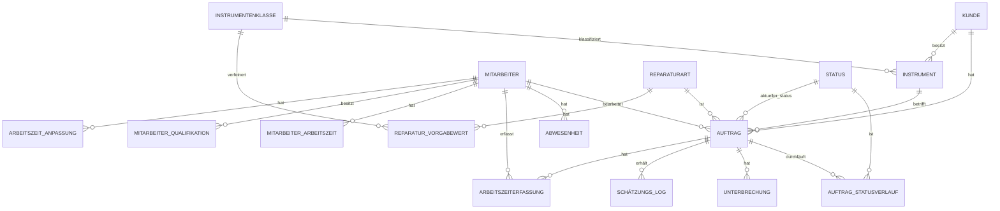

# Datenmodell: Auftragsmanagement Reparaturwerkstatt für Musikinstrumente

Dieses Dokument beschreibt das Datenmodell für Version 1 (regelbasierte Terminschätzung) und legt gleichzeitig die Grundlage für Version 2 (datengetriebene Schätzung mittels ML), ohne dass später ein Umbau nötig wird.

---

## 1. Grundprinzip

Jeder Statuswechsel eines Auftrags wird als eigener Datensatz mit Zeitstempel gespeichert (nicht nur als aktuelles Statusfeld). Nur so lassen sich später echte Bearbeitungszeiten pro Instrumentenklasse und Reparaturart auswerten.

---

## 2. Tabellen

### 2.1 `kunde`

| Feld | Typ | Beschreibung |
|---|---|---|
| id | UUID / SERIAL | Primärschlüssel |
| kundennummer | VARCHAR, UNIQUE | Wird automatisch vergeben, Format `K-00001` (fortlaufend) |
| externe_kundennummer | VARCHAR(50), UNIQUE (falls gesetzt) | Optional. Kundennummer aus dem Buchhaltungssystem der Werkstatt, damit sich Kunden in beiden Systemen eindeutig zuordnen lassen. Führende und abschließende Leerzeichen werden entfernt, eine leere Eingabe gilt als "kein Wert" (mehrere Kunden ohne Nummer sind zulässig). Die Eindeutigkeit gilt auch gegenüber archivierten Kunden und ohne Beachtung der Groß-/Kleinschreibung ("fibu-1" und "FIBU-1" sind dieselbe Nummer). Bei einem Konflikt nennt die Meldung den betroffenen Kunden, z. B. "Diese externe Kundennummer ist bereits vergeben (Kunde K-00001)", bei archivierten Kunden mit dem Zusatz "archiviert". Auffindbar in Kundenliste (Spalte "Ext. Nr.") und Suche |
| name | VARCHAR | |
| email | VARCHAR | Optional, für Statusbenachrichtigungen; wird auf gültiges Format geprüft |
| telefon | VARCHAR | Optional |
| erstellt_am | TIMESTAMP | |
| archiviert_am | TIMESTAMP | NULL = aktiv. Archivierte Kunden fehlen in normalen Listen, sind für neue Aufträge gesperrt, bleiben mit allen alten Aufträgen aber erhalten |

**Regeln:** Anlegen/Bearbeiten dürfen alle eingeloggten Mitarbeiter (gehört zur Auftragsannahme), Archivieren/Reaktivieren nur Werkstattleiter und Admin. Ein Kunde mit offenen Aufträgen lässt sich nicht archivieren. Jede Änderung (angelegt, geändert mit alt/neu, archiviert, reaktiviert) landet im Änderungsprotokoll (`system_ereignis_log`, 7.3).

**Sicherheitshinweis:** Zum sicheren Dashboard-Zugriff wird zusätzlich zur Auftragsnummer ein Zugriffstoken benötigt — Details siehe Abschnitt 6 "Kundenauthentifizierung".

---

### 2.2 `mitarbeiter`

| Feld | Typ | Beschreibung |
|---|---|---|
| id | UUID / SERIAL | Primärschlüssel |
| name | VARCHAR | |
| rolle | VARCHAR | Fachliche Rolle, z. B. Geigenbauer, Blechblas-Techniker |
| systemrolle | ENUM | `mitarbeiter` / `werkstattleiter` / `admin` — steuert die Berechtigungen in der Software (siehe Abschnitt 7) |
| email | VARCHAR | Für Login |
| passwort_hash | VARCHAR | Niemals Klartext speichern |
| aktiv | BOOLEAN | Für ausgeschiedene Mitarbeiter — Datensatz wird deaktiviert, nicht gelöscht, damit die Auftragshistorie erhalten bleibt |
| erstellt_am | TIMESTAMP | |
| deaktiviert_am | TIMESTAMP | NULL solange aktiv |

**Deaktivieren und Reaktivieren:** Nur Admin. Beim Deaktivieren wird `aktiv = false` und `deaktiviert_am` gesetzt, gelöscht wird nichts. Ein bereits ausgestelltes Login-Token funktioniert danach sofort nicht mehr, eine neue Anmeldung wird abgelehnt. Beim Reaktivieren wird `aktiv = true` gesetzt und `deaktiviert_am` geleert. Ein Mitarbeiter mit offenen zugewiesenen Aufträgen lässt sich nicht deaktivieren (erst neu zuweisen), erledigte Aufträge stören nicht.

**Schutz gegen Aussperren:** Ein Admin kann sich weder selbst deaktivieren noch sich selbst die Admin-Rolle entziehen. Der letzte aktive Admin kann weder deaktiviert noch herabgestuft werden (technisch abgesichert durch Zeilensperre, falls sich zwei Admins gleichzeitig herabstufen). Rollenänderungen wirken sofort, auch bei bestehendem Login-Token.

---

### 2.3 `abwesenheit`

Für Urlaub, Krankheit, Feiertage — wichtig sowohl für die interne Kapazitätsplanung als auch später als Modell-Feature ("Saisonalität").

| Feld | Typ | Beschreibung |
|---|---|---|
| id | UUID / SERIAL | Primärschlüssel |
| mitarbeiter_id | FK → mitarbeiter | NULL = betrifft ganze Werkstatt (z. B. Betriebsurlaub) |
| von_datum | DATE | |
| bis_datum | DATE | |
| typ | VARCHAR | Urlaub / Krankheit / Feiertag / Betriebsschließung / Schulung / Reduzierte Stunden |
| reduzierte_stunden | DECIMAL | NULL = ganztägig abwesend im angegebenen Zeitraum. Ansonsten: die in diesem Zeitraum tatsächlich **verfügbare** Wochenstundenzahl (absoluter Wert, kein Abzugsbetrag) — z. B. "diese Woche nur 20 Std. verfügbar" wegen Arztterminen o. Ä., statt der vollen `mitarbeiter_arbeitszeit.wochenstunden` |
| notiz | TEXT | Optional, höchstens 500 Zeichen, z. B. "Betriebsurlaub Weihnachten". Eine leere Eingabe zählt als "keine Notiz" |
| storniert_am | TIMESTAMP | NULL = gilt. Stornierte Einträge bleiben erhalten, zählen aber nicht mehr für die Terminschätzung |

**Regeln:**
- Urlaub, Krankheit, Schulung und Reduzierte Stunden brauchen einen aktiven Mitarbeiter. Feiertag und Betriebsschließung gelten immer für die ganze Werkstatt (`mitarbeiter_id` = NULL)
- `reduzierte_stunden` ist bei jedem persönlichen Typ zulässig (Urlaub, Krankheit, Schulung, Reduzierte Stunden) — erlaubt z. B. einen halben Urlaubstag, statt eine andere Abwesenheit dafür vorzutäuschen. Wert über 0 und höchstens 80, bei Feiertag/Betriebsschließung nicht zulässig (immer ganztägig)
- Schutz vor Doppeleinträgen: Derselbe Typ für dieselbe Person im überschneidenden Zeitraum wird abgelehnt, mit Verweis auf den vorhandenen Eintrag. Verschiedene Typen dürfen sich überschneiden (z. B. krank im Urlaub)
- Eine stornierte Abwesenheit lässt sich erst nach dem Wiederherstellen bearbeiten
- Abwesenheiten in der Vergangenheit sind erlaubt (z. B. nachgetragene Krankheit)
- Pflege nur durch Werkstattleitung und Admin (siehe 7.2)
- Neue Terminschätzungen berücksichtigen Abwesenheiten sofort; bereits berechnete Termine werden nicht automatisch angepasst (siehe 4.0a)

---

### 2.4 `instrumentenklasse`

Strukturierte Kategorie statt Freitext — Pflicht für spätere Auswertbarkeit.

| Feld | Typ | Beschreibung |
|---|---|---|
| id | UUID / SERIAL | Primärschlüssel |
| bezeichnung | VARCHAR, UNIQUE | z. B. "Violine", "Trompete", "Klarinette", "Klavier" |
| instrumentenfamilie_id | FK → instrumentenfamilie | Gruppierung der Klassen (siehe 2.4a). Ersetzt das frühere Freitextfeld `oberkategorie` |
| archiviert_am | TIMESTAMP | NULL = aktiv. Archivierte Einträge fehlen in den Auswahllisten und sind für neue Aufträge, Instrumente und Vorgabewerte gesperrt; bestehende Datensätze behalten sie |

**Pflege:** nur Admin (anlegen, bearbeiten, archivieren, reaktivieren). Eine doppelte Bezeichnung wird mit dem Hinweis abgelehnt, einen eventuell archivierten Eintrag zu reaktivieren.

---

### 2.4a `instrumentenfamilie`

Feste Auswahlliste statt Freitext, damit Instrumentenklassen sich gruppieren und filtern lassen und keine Tippfehler-Varianten wie "Blechblas" und "Blechbläser" entstehen.

| Feld | Typ | Beschreibung |
|---|---|---|
| id | UUID / SERIAL | Primärschlüssel |
| bezeichnung | VARCHAR, UNIQUE | z. B. "Streichinstrumente", "Zupfinstrumente", "Holzblasinstrumente", "Blechblasinstrumente", "Tasteninstrumente", "Schlagwerk", "Sonstige" |
| reihenfolge | INT | Feste, vom Admin bestimmte Anzeigereihenfolge (Familien werden nicht alphabetisch sortiert) |
| archiviert_am | TIMESTAMP | NULL = aktiv |

**Regeln:** Pflege nur durch den Admin. Eine Familie mit aktiven Instrumentenklassen lässt sich nicht archivieren. Innerhalb einer Familie werden die Klassen alphabetisch sortiert. **Migration:** Die bisherigen `oberkategorie`-Werte werden zu Familien, Klassen ohne Wert kommen in "Sonstige".

---

### 2.5 `instrument`

Erfasst das konkrete Instrument eines Kunden — getrennt von der Klasse (2.4), damit Hersteller, Typenbezeichnung und Baujahr gespeichert werden können. Ein Kunde kann mehrere Instrumente haben, ein Instrument kann über die Zeit mehrere Aufträge durchlaufen.

| Feld | Typ | Beschreibung |
|---|---|---|
| id | UUID / SERIAL | Primärschlüssel |
| kunde_id | FK → kunde | Eigentümer des Instruments |
| instrumentenklasse_id | FK → instrumentenklasse | z. B. "Violine" |
| hersteller | VARCHAR | z. B. "Yamaha", "Stainer", Werkstattname bei Manufakturinstrumenten |
| typenbezeichnung | VARCHAR | Modell-/Typbezeichnung, z. B. "YFL-222" |
| baujahr | INT | Optional, falls bekannt/schätzbar |
| seriennummer | VARCHAR | Optional, hilfreich zur eindeutigen Identifikation bei Folgeaufträgen |
| notizen | TEXT | z. B. Besonderheiten, bekannte Vorschäden |
| archiviert_am | TIMESTAMP | NULL = aktiv, sonst wie bei `kunde` (2.1) |

**Regeln:** Der Besitzer (`kunde_id`) lässt sich nach dem Anlegen nicht ändern; bei einem Besitzerwechsel wird das alte Instrument archiviert und ein neues angelegt, damit die Historie sauber bleibt. Instrumente mit offenen Aufträgen lassen sich nicht archivieren. Berechtigungen und Protokollierung wie bei `kunde`.

**Reparaturhistorie (Option, geringe Priorität):** Da jeder Auftrag über `instrument_id` einem Instrument zugeordnet ist, lässt sich die Reparaturhistorie eines Instruments ohne Schemaänderung darstellen. Vorgesehen ist eine reine Leseansicht am Instrument mit den zugehörigen Aufträgen (Auftragsnummer, Datum, Reparaturart, Status, Arbeitszeit).

**Nutzen fürs spätere Modell (Stufe 2):** Hersteller/Baujahr können als zusätzliche Merkmale einfließen — ältere oder bestimmte Hersteller-Instrumente benötigen bei manchen Reparaturarten erfahrungsgemäß mehr Zeit (z. B. Ersatzteilbeschaffung bei alten oder seltenen Modellen).

---

### 2.6 `reparaturart`

| Feld | Typ | Beschreibung |
|---|---|---|
| id | UUID / SERIAL | Primärschlüssel |
| bezeichnung | VARCHAR, UNIQUE | z. B. "Saitenwechsel", "Ventil-Überholung", "Rissreparatur Decke" |
| standard_komplexität | INT (1–5) | Vorbelegung, kann pro Auftrag überschrieben werden |
| reparaturkategorie_id | FK → reparaturkategorie | Art der Arbeit (siehe 2.6b), Pflichtfeld |
| archiviert_am | TIMESTAMP | NULL = aktiv, sonst wie bei `instrumentenklasse` (2.4) |

**Pflege:** nur Admin, Regeln wie bei `instrumentenklasse`.

---

### 2.6a `reparatur_vorgabewert`

Vorgabedaten je Reparaturart (optional zusätzlich verfeinert je Instrumentenklasse), damit ein Mitarbeiter schon bei Auftragsannahme eine ungefähre Orientierung zu Dauer und Kosten hat — auch bevor genug reale historische Daten vorliegen. Dient außerdem als Ausgangswert ("Prior"), der mit zunehmender Anzahl abgeschlossener Aufträge zunehmend durch echte historische Durchschnittswerte ergänzt bzw. abgelöst wird (siehe Abschnitt 4).

| Feld | Typ | Beschreibung |
|---|---|---|
| id | UUID / SERIAL | Primärschlüssel |
| reparaturart_id | FK → reparaturart | |
| instrumentenklasse_id | FK → instrumentenklasse | Optional (NULL = gilt allgemein für die Reparaturart, unabhängig von der Instrumentenklasse). Ein Eintrag mit gesetzter Instrumentenklasse überschreibt für diese Kombination den allgemeinen Wert (z. B. "Saitenwechsel" allgemein 0,5 Std., aber für "Kontrabass" spezifisch 1,5 Std.) |
| vorgabe_stunden | DECIMAL | Erwarteter Arbeitsaufwand in Stunden |
| vorgabe_kosten | DECIMAL | Erwarteter Preis für den Kunden (Arbeits- + ggf. übliche Materialkosten als Pauschale) |
| notiz | TEXT | Optional, z. B. "inkl. neuer Saiten, exkl. Spezialsaiten" |
| archiviert_am | TIMESTAMP | NULL = aktiv. Archivierte Vorgabewerte werden von der Schätzung ignoriert (es greift dann der allgemeine Wert bzw. der historische Durchschnitt) |
| geändert_von_mitarbeiter_id | FK → mitarbeiter | |
| geändert_am | TIMESTAMP | |

**Pflege:** Über den Administrationsbereich, Systemrolle `admin` (siehe Berechtigungsmatrix, Abschnitt 7.2) — passt zur bestehenden Stammdatenpflege von Instrumentenklassen und Reparaturarten.

**Archivieren und Reaktivieren:** Nur Admin. Damit lässt sich ein versehentlich angelegter spezifischer Wert (z. B. für eine einzelne Instrumentenklasse) wieder zurücknehmen, sodass der allgemeine Wert nicht dauerhaft überschattet bleibt. Die Eindeutigkeit der Kombination aus Reparaturart und Instrumentenklasse gilt nur für aktive Einträge (per Datenbank-Index abgesichert).

- Ein archivierter Vorgabewert lässt sich erst nach dem Reaktivieren bearbeiten
- Reaktivieren wird abgelehnt, solange für dieselbe Kombination ein anderer Wert aktiv ist ("erst den aktiven Wert archivieren")
- Archivieren und Reaktivieren setzen `geändert_von` und `geändert_am`

**Regel bei Archivierung:** Neue Vorgabewerte dürfen nicht auf archivierte Reparaturarten oder Instrumentenklassen verweisen. Bestehende Vorgabewerte bleiben auch dann bearbeitbar (z. B. um den Preis anzupassen).

---

### 2.6b `reparaturkategorie`

Gliedert die Reparaturarten nach der Art der Arbeit, unabhängig vom Instrument.

| Feld | Typ | Beschreibung |
|---|---|---|
| id | UUID / SERIAL | Primärschlüssel |
| bezeichnung | VARCHAR, UNIQUE | z. B. "Saiten und Bespannung", "Mechanik und Ventile", "Korpus und Holz", "Oberfläche und Lack", "Elektronik", "Wartung und Einstellung", "Generalüberholung", "Unkategorisiert" |
| reihenfolge | INT | Feste, vom Admin bestimmte Anzeigereihenfolge |
| archiviert_am | TIMESTAMP | NULL = aktiv |

**Regeln:** Pflege nur durch den Admin. Jede Reparaturart gehört zu genau einer Kategorie. Eine Kategorie mit aktiven Reparaturarten lässt sich nicht archivieren. Innerhalb einer Kategorie werden die Reparaturarten alphabetisch sortiert. **Migration:** Bestehende Reparaturarten kommen zunächst in "Unkategorisiert" und werden vom Admin zugeordnet (für die Demodaten schlägt die Umsetzung eine sinnvolle Zuordnung vor).

---

### 2.7 `auftrag`

Die zentrale Tabelle.

| Feld | Typ | Beschreibung |
|---|---|---|
| id | UUID / SERIAL | Primärschlüssel |
| auftragsnummer | VARCHAR, UNIQUE | Für Kunden sichtbar, dient als Referenz — allein nicht ausreichend für den Dashboard-Zugriff (siehe Abschnitt 6) |
| zugriffstoken | VARCHAR, UNIQUE | Zufällig generierter Code (z. B. 10–12 alphanumerische Zeichen), zusammen mit der Auftragsnummer der einzige Schlüssel zum Kunden-Dashboard. Wird bei Auftragsannahme erzeugt und auf dem Abgabebeleg/als QR-Code ausgegeben. Muss kryptografisch zufällig sein, nicht aus anderen Feldern ableitbar |
| kunde_id | FK → kunde | |
| instrument_id | FK → instrument | Ersetzt die direkte Referenz auf `instrumentenklasse` — die Klasse ergibt sich über den Join `instrument.instrumentenklasse_id` |
| reparaturart_id | FK → reparaturart | Bei mehreren Arbeiten am selben Instrument: separate Aufträge oder Teilaufgaben-Tabelle |
| zugewiesener_mitarbeiter_id | FK → mitarbeiter | Kann initial NULL sein (noch nicht zugewiesen) |
| priorität | ENUM (`normal` / `hoch`) | Manuell durch Werkstattleiter/Admin setzbar, z. B. bei Eilaufträgen oder Kulanzfällen. Fließt in die Sortierung der Mitarbeiter- und Werkstattleiter-Dashboards ein (siehe Abschnitt 9) |
| komplexität | INT (1–5) | Vom Mitarbeiter bei Anlage geschätzt |
| status_aktuell_id | FK → status | Redundant zu Performance-Zwecken — Quelle der Wahrheit ist `auftrag_statusverlauf` |
| erstellt_am | TIMESTAMP | |
| geschätztes_fertigstellungsdatum | DATE | Ergebnis der Berechnung (Stufe 1 oder 2) |
| geschätzte_bandbreite_von | DATE | z. B. für Anzeige "zwischen dem 12. und 16.10." |
| geschätzte_bandbreite_bis | DATE | |
| geschätzte_arbeitsstunden | DECIMAL | Geschätzter reiner Arbeitsaufwand in Stunden (nicht Kalenderdauer) — Grundlage für die Kapazitätsplanung (Abschnitt 9.9). Wird wie die Terminschätzung selbst aus historischen `arbeitszeiterfassung`-Werten vergleichbarer Kombinationen aus Instrumentenklasse/Reparaturart berechnet, mit Fallback auf `reparatur_vorgabewert` (2.6a), solange zu wenig historische Daten vorliegen |
| geschätzte_kosten | DECIMAL | Voraussichtlicher Preis für den Kunden — analog zu `geschätzte_arbeitsstunden` berechnet (historischer Durchschnitt tatsächlicher Kosten vergleichbarer Aufträge, Fallback auf `reparatur_vorgabewert.vorgabe_kosten`) |
| tatsächliche_kosten | DECIMAL | Tatsächlich abgerechneter Preis — NULL bis Abschluss. Wie `tatsächliches_fertigstellungsdatum` ein Trainingswert für Stufe 2, hier für die Kostenschätzung statt der Terminschätzung |
| tatsächliches_fertigstellungsdatum | DATE | NULL bis abgeschlossen — **das ist dein Trainingslabel für Stufe 2** |
| notizen | TEXT | Freitext für interne Zwecke |

---

### 2.7a `status`

Nachschlagetabelle für Auftragsstatus — eingeführt bei der UI-Umsetzung, damit Farbe und Symbol (Abschnitt 9.3/9.6) direkt aus der Datenbank kommen, statt im Frontend-Code hinterlegt zu sein. Neue Status lassen sich damit ohne Code-Änderung ergänzen.

| Feld | Typ | Beschreibung |
|---|---|---|
| id | UUID / SERIAL | Primärschlüssel |
| bezeichnung | VARCHAR | z. B. "Angenommen", "In Bearbeitung", "Wartet auf Ersatzteil", "Qualitätsprüfung", "Fertig", "Abgeholt" |
| farbe | VARCHAR | Hex-Wert, siehe Statusfarben-Tabelle in Abschnitt 9.6 |
| symbol | VARCHAR | z. B. "○", "◐", "⏸", "◑", "✓", "●" |
| reihenfolge | INT | Für konsistente Sortierung/Anzeige (z. B. in Auswahllisten) |

**Aktuelle Werte** (siehe Abschnitt 9.6 für die vollständige Farbtabelle): Angenommen (○, Grau), In Bearbeitung (◐, Blau), Wartet auf Ersatzteil (⏸, Orange), Qualitätsprüfung (◑, Violett), Fertig (✓, Grün), Abgeholt (●, dunkles Neutral `#5E554C`).

---

### 2.8 `auftrag_statusverlauf`

Kernstück für spätere Auswertung — jeder Wechsel wird protokolliert, nichts wird überschrieben.

| Feld | Typ | Beschreibung |
|---|---|---|
| id | UUID / SERIAL | Primärschlüssel |
| auftrag_id | FK → auftrag | |
| status_id | FK → status | |
| geändert_am | TIMESTAMP | |
| geändert_von_mitarbeiter_id | FK → mitarbeiter | |
| kommentar | TEXT | Optional |

---

### 2.9 `unterbrechung`

Erfasst Gründe für Verzögerungen — wichtig, damit das spätere Modell "hausgemachte" Verzögerungen (Ersatzteillieferzeit) von echter Bearbeitungsdauer unterscheiden kann.

| Feld | Typ | Beschreibung |
|---|---|---|
| id | UUID / SERIAL | Primärschlüssel |
| auftrag_id | FK → auftrag | |
| grund | VARCHAR | z. B. "Ersatzteil bestellt", "Rückfrage beim Kunden", "Zusatzschaden entdeckt" |
| von_datum | TIMESTAMP | |
| bis_datum | TIMESTAMP | NULL solange ungelöst |

---

### 2.10 `schätzungs_log` (für Stufe 2 vorbereitet)

Protokolliert jede automatische Schätzung **und** jede manuelle Korrektur durch einen Mitarbeiter oder Werkstattleiter — damit du später prüfen kannst, wie gut das Modell tatsächlich war (Ist- vs. Prognosewert), und nachvollziehbar bleibt, wer wann aus welchem Grund manuell eingegriffen hat.

| Feld | Typ | Beschreibung |
|---|---|---|
| id | UUID / SERIAL | Primärschlüssel |
| auftrag_id | FK → auftrag | |
| berechnet_am | TIMESTAMP | |
| methode | VARCHAR | "regelbasiert" / "ml_modell_v1" / "manuelle_korrektur" |
| geschätztes_datum | DATE | Optional, je nachdem was bei diesem Log-Eintrag geschätzt/korrigiert wurde |
| geschätzte_stunden | DECIMAL | Optional, siehe oben |
| geschätzte_kosten | DECIMAL | Optional, siehe oben |
| eingabefaktoren | JSONB | Snapshot der Faktoren zum Berechnungszeitpunkt (Auftragsvolumen, verfügbare Mitarbeiter, Saison etc.) — wichtig für Nachvollziehbarkeit und späteres Modell-Debugging |
| korrigiert_von_mitarbeiter_id | FK → mitarbeiter | NULL bei automatischer Berechnung, gesetzt bei `methode = "manuelle_korrektur"` |
| grund | TEXT | Nur bei manueller Korrektur relevant, z. B. "Instrument in sehr schlechtem Zustand, deutlich mehr Aufwand als Standardfall" |

**Ablauf bei manueller Korrektur:** Ein neuer Eintrag mit `methode = "manuelle_korrektur"` wird angelegt (der automatisch berechnete Wert bleibt als vorheriger Log-Eintrag erhalten, wird nicht überschrieben), und `auftrag.geschätzte_arbeitsstunden`/`geschätzte_kosten` werden auf den korrigierten Wert aktualisiert — das ist dann der für Dashboards und Kunden-Anzeige maßgebliche, aktuelle Wert.

**Wichtig für Stufe 2:** Eine manuelle Korrektur der *Schätzung* verändert nicht die späteren *Ist-Werte* (`arbeitszeiterfassung`, `auftrag.tatsächliche_kosten`) — diese werden weiterhin unabhängig aus der echten Bearbeitung erfasst. Die Trainingsdaten für das spätere ML-Modell bleiben dadurch unverfälscht.

---

### 2.11 `arbeitszeiterfassung`

Erfasst die tatsächlich aufgewendete Arbeitszeit je Auftrag — Grundlage für die Abrechnung und, unabhängig davon, ein präziseres Merkmal für die Terminschätzung als die reine Kalenderdauer: Ein Auftrag kann kalendarisch zwei Wochen dauern, aber nur drei Stunden reine Werkstattzeit umfassen (Rest ist Warten auf Ersatzteile, siehe `unterbrechung`). Für Stufe 2 ist die reine Arbeitszeit daher oft das aussagekräftigere Trainingsmerkmal als das Enddatum allein.

| Feld | Typ | Beschreibung |
|---|---|---|
| id | UUID / SERIAL | Primärschlüssel |
| auftrag_id | FK → auftrag | |
| mitarbeiter_id | FK → mitarbeiter | Falls mehrere Mitarbeiter am selben Auftrag gearbeitet haben, entsteht je Mitarbeiter ein eigener Eintrag |
| dauer_minuten | INT | Vom Mitarbeiter beim Abschluss eingegeben |
| erfasst_am | TIMESTAMP | Zeitpunkt der Eingabe (i. d. R. beim Setzen des Status "Fertig") |
| kommentar | TEXT | Optional, z. B. "davon 20 Min. Wartezeit auf Kleber-Trocknung" |

**Auslösender Workflow:** Setzt ein Mitarbeiter den Auftragsstatus auf "Fertig", fordert die Oberfläche verpflichtend die Eingabe der aufgewendeten Arbeitszeit an, bevor der Statuswechsel abgeschlossen wird (siehe Abschnitt 9.8). Bei mehreren Bearbeitungssitzungen (z. B. Unterbrechung durch Ersatzteilbestellung, danach Weiterarbeit) können auch mehrere Einträge über die Laufzeit des Auftrags entstehen — die Summe aller `dauer_minuten` je Auftrag ergibt die gesamte Bearbeitungszeit.

---

### 2.12 `mitarbeiter_arbeitszeit`

Vertraglich vereinbarte Wochenarbeitsstunden je Mitarbeiter — Grundlage der Kapazitätsplanung (Abschnitt 9.9). Als eigene Tabelle mit Gültigkeitszeitraum angelegt statt als einfaches Feld in `mitarbeiter`, damit Änderungen (z. B. Aufstockung von Teilzeit) nachvollziehbar bleiben und rückwirkende Auswertungen weiterhin den zum jeweiligen Zeitpunkt gültigen Wert verwenden.

| Feld | Typ | Beschreibung |
|---|---|---|
| id | UUID / SERIAL | Primärschlüssel |
| mitarbeiter_id | FK → mitarbeiter | |
| wochenstunden | DECIMAL | z. B. 35,0 |
| gültig_ab | DATE | |
| gültig_bis | DATE | NULL = aktuell gültig |
| geändert_von_mitarbeiter_id | FK → mitarbeiter | Wer die Änderung vorgenommen hat (Admin). Der Name bleibt im Protokoll und in Verläufen sichtbar, auch wenn dieser Mitarbeiter später deaktiviert wird |
| geändert_am | TIMESTAMP | |

**Pflege:** Ausschließlich über den Administrationsbereich durch die Systemrolle `admin` (siehe Berechtigungsmatrix, Abschnitt 7.2) — ein neuer Eintrag mit neuem `gültig_ab`-Datum schließt automatisch den vorherigen Eintrag ab (`gültig_bis` = Tag davor), statt den alten Wert zu überschreiben.

**Regeln:**
- Je Mitarbeiter ist höchstens ein Eintrag gleichzeitig offen (`gültig_bis` = NULL), das erzwingt die Datenbank
- Ein neuer Wert muss später beginnen als der bisher gültige. Rückdatieren vor den aktuellen Eintrag und eine zweite Änderung am selben Tag werden abgelehnt. Ein Tippfehler lässt sich deshalb derzeit nur mit einem neuen Eintrag ab einem späteren Datum korrigieren (eine eigene Korrekturfunktion steht als möglicher späterer Ausbau im Backlog)
- Zulässige Werte: über 0 und höchstens 80 Wochenstunden, maximal 2 Nachkommastellen
- Beim Abschließen des alten Eintrags ändert sich dort nur `gültig_bis`. `geändert_von`/`geändert_am` des alten Eintrags bleiben unverändert, wer abgeschlossen hat, steht im neuen Eintrag und im Änderungsprotokoll
- Für deaktivierte Mitarbeiter können keine Wochenstunden festgelegt werden
- Wo nichts hinterlegt ist, gilt ein Standard von 40 Wochenstunden. Die Admin-Liste kennzeichnet, ob ein Wert "hinterlegt" oder der "Standard" ist
- Im Verlauf gilt als "aktuell" der Eintrag, dessen Zeitraum den heutigen Tag einschließt, auch wenn sein `gültig_bis` durch einen späteren Eintrag bereits feststeht. Ein Eintrag mit `gültig_ab` in der Zukunft gilt als "geplant"
- Eine Änderung der Wochenstunden wirkt direkt auf künftige Terminschätzungen, bestehende Termine werden nicht automatisch neu berechnet (siehe 4.0a), bei Bedarf mit `termine_nachrechnen --alle`

---

### 2.13 `mitarbeiter_qualifikation`

Hält fest, wofür ein Mitarbeiter durch Ausbildung oder Schulung qualifiziert ist. Wird anfangs von der Berechnungslogik noch nicht ausgewertet, ist aber ohne Mehraufwand mitgepflegt und später direkt nutzbar — z. B. um bei der Auftragszuweisung nur qualifizierte Mitarbeiter vorzuschlagen oder als zusätzliches Merkmal für die Stufe-2-Schätzung (erfahrene vs. neu qualifizierte Mitarbeiter brauchen bei derselben Reparaturart oft unterschiedlich lang).

| Feld | Typ | Beschreibung |
|---|---|---|
| id | UUID / SERIAL | Primärschlüssel |
| mitarbeiter_id | FK → mitarbeiter | |
| reparaturart_id | FK → reparaturart | Optional — wofür die Qualifikation gilt |
| instrumentenklasse_id | FK → instrumentenklasse | Optional — alternativ oder zusätzlich auf Instrumentenklasse bezogen |
| bezeichnung | VARCHAR | z. B. "Zertifikat E-Gitarren-Elektronik", "Meisterkurs Blechblasinstrumente" |
| erworben_am | DATE | |
| gültig_bis | DATE | Optional, für Zertifikate mit Ablaufdatum — NULL = unbefristet |

**Zusammenhang mit Abwesenheit:** Die Schulung selbst (der Zeitraum, in dem der Mitarbeiter nicht für Reparaturen verfügbar ist) wird über `abwesenheit` mit `typ = "Schulung"` erfasst (siehe 2.3) — diese Tabelle hält nur das *Ergebnis* der Schulung fest, nicht den Abwesenheitszeitraum selbst.

---

### 2.14 `arbeitszeit_anpassung`

Bildet Gleitzeit-Ausgleich ab, ohne ein vollständiges Zeiterfassungssystem (Kommen/Gehen-Stempeluhr) bauen zu müssen — das wäre ein eigenes Thema jenseits des Auftragsmanagements. Stattdessen werden nur die Wochen-Abweichungen von der Regelarbeitszeit erfasst.

| Feld | Typ | Beschreibung |
|---|---|---|
| id | UUID / SERIAL | Primärschlüssel |
| mitarbeiter_id | FK → mitarbeiter | |
| woche_start_datum | DATE | Montag der betroffenen Woche |
| anpassung_stunden | DECIMAL | Positiv = mehr Kapazität diese Woche (z. B. `+5`), negativ = Ausgleichstag/-stunden (z. B. `-8`) |
| grund | VARCHAR | z. B. "Gleitzeitausgleich", "Vorarbeit vor Betriebsurlaub" |
| erfasst_von_mitarbeiter_id | FK → mitarbeiter | |
| erfasst_am | TIMESTAMP | |

**Aktueller Gleitzeitsaldo** eines Mitarbeiters ergibt sich bei Bedarf durch Summierung aller bisherigen Einträge — muss nicht separat als eigener Wert gepflegt werden. Wird anfangs von der Kapazitätsberechnung (Abschnitt 8) noch nicht zwingend einbezogen, lässt sich aber später als zusätzlicher Term in die Formel aufnehmen, ohne die Struktur zu ändern.

---

## 3. Beziehungsdiagramm (vereinfacht)



---

## 4. Stufe 1: Regelbasierte Berechnungslogik

**Umgesetzte Logik (Warteschlangen-Prinzip):**

```
vorlauf_stunden =
    Summe(geschätzte_arbeitsstunden aller offenen Aufträge desselben Mitarbeiters,
          die nach Priorität + Eingang vor diesem Auftrag stehen, siehe 9.4)
    (bei nicht zugewiesenem Auftrag: durchschnittliche offene Arbeit pro Mitarbeiter als Fallback)

benötigte_stunden = vorlauf_stunden + auftrag.geschätzte_arbeitsstunden (siehe 4.1)

verfügbare_stunden_pro_tag = mitarbeiter_arbeitszeit.wochenstunden / 5
    (Wochenenden, Betriebsschließungen, Feiertage, Urlaub übersprungen;
     an Tagen mit abwesenheit.reduzierte_stunden gilt reduzierte_stunden / 5 statt der vollen Wochenstunden)

geschätztes_fertigstellungsdatum = der Arbeitstag, an dem benötigte_stunden 
    durch tägliches Abarbeiten ab morgen aufgebraucht sind

geschätzte_bandbreite = ± 20 % der benötigten Arbeitstage, mindestens ± 1 Tag
```

`auftrag.geschätzte_arbeitsstunden` (die Grundlage für `benötigte_stunden`) wird wie in Abschnitt 4.1 beschrieben ermittelt: historischer Durchschnitt vergleichbarer abgeschlossener Aufträge, mit Fallback auf `reparatur_vorgabewert` (2.6a), solange zu wenig historische Daten vorliegen (Schwellenwert: 5 Vergleichsfälle).

**Neuberechnung ausgelöst bei:** Auftragserstellung, Änderung von Zuweisung oder Priorität (über `PATCH /auftraege/{id}`, nur Werkstattleiter/Admin). Jede Berechnung wird in `schätzungs_log` protokolliert, inkl. Anlass und allen verwendeten Zahlen (z. B. "13,50 Std. Vorlauf (4 Aufträge davor) + 0,50 Std., 8,00 Std./Tag, 2 Arbeitstage").

### 4.0a Bekannte vereinfachte Annahmen (Version 1)

Bewusste Vereinfachungen für den Start, festgehalten für spätere Überarbeitung:

- Pausierte Aufträge (siehe `unterbrechung`, 2.9) zählen voll zum Vorlauf mit; bereits geleistete Teilarbeit wird nicht vom Vorlauf abgezogen
- Ändert sich die Warteschlange eines Mitarbeiters (z. B. neuer Eilauftrag mit hoher Priorität schiebt sich davor), werden die Termine der anderen, bereits laufenden Aufträge desselben Mitarbeiters nicht automatisch neu berechnet
- Nach einer manuellen Korrektur der Stunden (4.2) wird der Termin nicht automatisch neu berechnet — die Werkstattleitung müsste das bei Bedarf manuell anstoßen (z. B. durch kurzes Ändern der Priorität)
- Ohne hinterlegte `mitarbeiter_arbeitszeit` gilt ein Standard-Fallback von 40 Wochenstunden


### 4.1 Kostenschätzung (analoges Vorgehen)

Dieselbe Fallback-Logik wird für die Kostenschätzung verwendet — Grundlage für `auftrag.geschätzte_kosten`:

```
geschätzte_kosten =
    durchschnitt(bisherige_ist_kosten WHERE instrumentenklasse = X AND reparaturart = Y)
    (falls ausreichend historische Fälle vorhanden)
  ODER
    reparatur_vorgabewert.vorgabe_kosten (instrumentenklassen-spezifisch, sonst allgemein)
    (als Fallback, solange zu wenig historische Daten vorliegen)
```

`bisherige_ist_kosten` bezieht sich auf `auftrag.tatsächliche_kosten` vergleichbarer, bereits abgerechneter Aufträge.

### 4.2 Manuelle Korrektur der Schätzung

Stunden, Kosten und Termin lassen sich manuell überschreiben — z. B. wenn ein Mitarbeiter beim Öffnen des Instruments feststellt, dass der Zustand deutlich schlechter ist als der Standardfall und mehr Aufwand nötig sein wird, oder wenn ein bestelltes Sonderersatzteil einen bereits feststehenden, späteren Liefertermin hat, der sich nicht aus mehr Arbeitsstunden ergibt. Details zur technischen Umsetzung (Protokollierung, wer korrigieren darf) siehe `schätzungs_log` (2.10) und Berechtigungsmatrix (7.2).

**Unterschied bei den Berechtigungen:** Stunden und Kosten darf zusätzlich zu Werkstattleitung und Admin auch der zugewiesene Mitarbeiter korrigieren (siehe 7.2) — er beurteilt den Zustand des Instruments direkt vor Ort. Der Termin selbst ist sensibler, weil er die Zusage an den Kunden ist; seine manuelle Korrektur bleibt Werkstattleitung und Admin vorbehalten. Möchte ein Mitarbeiter auf einen abweichenden Termin hinweisen, meldet er das wie bisher an die Werkstattleitung, die dann korrigiert.

**Verhältnis zur automatischen Neuberechnung:** Wie bei den Stunden (4.0a) gilt auch für eine manuelle Terminkorrektur: Die nächste automatische Neuberechnung (bei Umzuweisung oder Prioritätsänderung, siehe Abschnitt 4) überschreibt sie wieder, es sei denn, die Werkstattleitung korrigiert danach erneut. Das ist eine bewusste Vereinfachung für den Start, kein eigenständiger "gesperrter" Zustand.

**Weitere Regeln bei der Terminkorrektur:**
- Die Bandbreite (`geschätzte_bandbreite_von/bis`) wird bei einer manuellen Terminkorrektur geleert, statt einen veralteten berechneten Zeitraum neben dem neuen Termin stehen zu lassen. Die nächste automatische Neuberechnung füllt sie wieder
- Der korrigierte Termin darf nicht vor dem Auftragseingang (`erstellt_am`) liegen; ein Datum in der Vergangenheit ist ansonsten zulässig (z. B. bei einem bereits überfälligen Auftrag)
- Der zuvor gültige Termin samt Bandbreite wird im neuen `schätzungs_log`-Eintrag mit festgehalten

---

## 5. Übergang zu Stufe 2 (ML-Modell)

Sobald ausreichend abgeschlossene Aufträge vorliegen (Richtwert: mind. 200–300, besser mehr, pro relevanter Kombination aus Instrumentenklasse/Reparaturart mindestens ~20–30):

- **Zielgröße (Label):** wahlweise `tatsächliches_fertigstellungsdatum − erstellt_am` (Kalenderdauer, ggf. abzüglich `unterbrechung`-Zeiten) oder die Summe der `arbeitszeiterfassung.dauer_minuten` je Auftrag (reine Bearbeitungszeit) — Letztere ist präziser, da sie Wartezeiten auf Ersatzteile o. ä. automatisch ausklammert
- **Merkmale (Features):** Instrumentenklasse, Hersteller, Baujahr, Reparaturart, Komplexität, Mitarbeiter, aktuelles Auftragsvolumen zum Erstellzeitpunkt, Monat/Saison, Anzahl gleichzeitig abwesender Mitarbeiter, historische durchschnittliche Arbeitszeit für vergleichbare Kombinationen aus Instrumentenklasse/Reparaturart
- **Zweites Modell für Kostenschätzung:** Analog zur Terminschätzung lässt sich ein zweites, gleich aufgebautes Modell für `tatsächliche_kosten` trainieren (dieselben Merkmale, eigenes Label). Beide Modelle teilen sich Trainingsdaten und Infrastruktur, sind aber unabhängig — Genauigkeit bei der Terminschätzung sagt nichts über die Genauigkeit der Kostenschätzung aus
- **Modelltyp:** Gradient Boosting (z. B. XGBoost/LightGBM) oder einfache multiple Regression — beides deutlich transparenter als neuronale Netze und für diese Datenmenge völlig ausreichend
- **Ausgabe:** idealerweise ein Vorhersageintervall statt eines Einzelwerts (z. B. 10./90. Perzentil), damit das Kunden-Dashboard eine Bandbreite statt eines Fixdatums anzeigen kann
- **Re-Training:** periodisch (z. B. monatlich) auf Basis aller neu abgeschlossenen Aufträge

Weil `schätzungs_log` von Anfang an mitläuft, kannst du beim Wechsel zu Stufe 2 direkt vergleichen: "Wie gut hätte das Modell in der Vergangenheit vorhergesagt?" (Backtesting), bevor es live geschaltet wird.

---

## 6. Kundenauthentifizierung (Dashboard-Zugriff ohne Login)

Ziel: Kunden sollen ihren Auftragsstatus abrufen können, ohne ein Benutzerkonto anzulegen oder sich mit Passwort anzumelden — die Hürde muss aber trotzdem hoch genug sein, dass niemand fremde Auftragsdaten einsehen kann.

### 6.1 Warum Postleitzahl als zweiter Faktor ungeeignet ist

- **Zu kleiner Wertebereich:** In Deutschland gibt es nur ca. 8.200 Postleitzahlen — automatisiertes Durchprobieren (Brute-Force) ist ohne große Hürden möglich
- **Kein echtes Geheimnis:** Nachbarn, Kollegen oder Familienmitglieder kennen häufig dieselbe PLZ
- **Nicht änderbar:** Einmal in Verbindung mit einem Namen bekannt (z. B. aus einer anderen Datenpanne), bleibt sie dauerhaft schwach

Die Postleitzahl erhöht die Sicherheit gegenüber einer alleinigen Auftragsnummer zwar etwas, ersetzt aber kein echtes Geheimnis.

### 6.2 Gewählter Ansatz: Zugriffstoken

Auftragsnummer + `zugriffstoken` (siehe 2.7) bilden gemeinsam den Schlüssel zum Dashboard:

- Der Token wird bei Auftragsannahme **kryptografisch zufällig** erzeugt (nicht aus Datum, Auftragsnummer o. ä. ableitbar)
- Er wird auf dem Abgabebeleg gedruckt oder als QR-Code mitgegeben — ähnlich der Sendungsverfolgung bei Paketdiensten, ein Muster, das Kunden bereits kennen
- Die Kundennummer wird für den Dashboard-Zugriff nicht mehr benötigt, da Auftragsnummer + Token bereits ausreichend eindeutig und sicher sind

### 6.3 Alternative/Ergänzung: Magic Link per E-Mail

Falls ohnehin E-Mail-Adressen erfasst werden (z. B. für Fertigstellungsbenachrichtigungen), ist das die sicherste Variante:

- Kunde gibt nur die Auftragsnummer ein
- System sendet einen zeitlich begrenzten Link an die hinterlegte E-Mail-Adresse
- Kein Code zum Abtippen nötig, dafür Abhängigkeit vom Mailversand (SMTP) und vom Zugriff auf die Mails im jeweiligen Moment

Für die erste Version empfiehlt sich der Zugriffstoken (Abschnitt 6.2) als einfachere, sofort umsetzbare Lösung; der Magic-Link-Ansatz lässt sich später ergänzen, ohne das Datenmodell zu ändern.

### 6.4 Zusätzliche Schutzmaßnahmen (unabhängig vom gewählten Verfahren)

- **Rate Limiting:** z. B. nach 5 Fehlversuchen pro IP-Adresse kurzzeitig sperren, um automatisiertes Durchprobieren zu verhindern
- **Keine differenzierte Fehlermeldung:** "Auftragsnummer oder Code ungültig" statt anzuzeigen, welcher Teil falsch war — sonst lässt sich die Kombination stückweise erraten
- **HTTPS zwingend**, damit Auftragsnummer und Token nicht im Klartext übertragen werden
- **Datenminimierung im Dashboard:** nur Status und voraussichtlicher Fertigstellungstermin anzeigen, keine sensiblen Zusatzdaten wie vollständige Adresse oder Telefonnummer

---

## 7. Administrationsbereich

Der Administrationsbereich ist kein separates System, sondern ein zusätzlicher Bereich der internen Oberfläche, der nur für die Systemrollen `werkstattleiter` und `admin` sichtbar ist (siehe `mitarbeiter.systemrolle`, Abschnitt 2.2). Normale Mitarbeiter sehen ihn nicht.

### 7.1 Warum zwei unterschiedliche Rollen statt nur "Admin"?

In der Praxis sind das zwei unterschiedliche Verantwortungsbereiche, die nicht zwingend dieselbe Person betreffen müssen (z. B. wenn ein externer Dienstleister die Software technisch betreut, aber der Werkstattleiter den Tagesbetrieb steuert):

- **Werkstattleiter:** verantwortet den **operativen Betrieb** — wer arbeitet woran, wer ist wann abwesend, wie ist die Auslastung
- **Admin:** verantwortet die **technische/strukturelle Verwaltung** des Systems — welche Mitarbeiter-Accounts es gibt, welche Kategorien/Stammdaten zur Verfügung stehen

Ein Admin hat automatisch auch alle Rechte eines Werkstattleiters (Rollen sind kumulativ), aber nicht umgekehrt.

### 7.2 Berechtigungsmatrix

| Funktion | Mitarbeiter | Werkstattleiter | Admin |
|---|---|---|---|
| Eigene zugewiesene Aufträge einsehen/bearbeiten | ✅ | ✅ | ✅ |
| Kunden und Instrumente anlegen/bearbeiten | ✅ | ✅ | ✅ |
| Kunden/Instrumente archivieren (z. B. bei Dubletten) | ❌ | ✅ | ✅ |
| Alle Aufträge werkstattweit einsehen | ❌ | ✅ | ✅ |
| Aufträge einem Mitarbeiter zuweisen/umverteilen | ❌ | ✅ | ✅ |
| Geschätztes Fertigstellungsdatum manuell korrigieren | ❌ | ✅ | ✅ |
| Geschätzte Arbeitsstunden/Kosten für eigene zugewiesene Aufträge manuell korrigieren (mit Begründung) | ✅ | ✅ | ✅ |
| Abwesenheiten (Urlaub/Krankheit) für Mitarbeiter eintragen | ❌ | ✅ | ✅ |
| Betriebsweite Abwesenheit eintragen (z. B. Betriebsurlaub) | ❌ | ✅ | ✅ |
| Gleitzeit-Anpassung erfassen | ❌ | ✅ | ✅ |
| Mitarbeiter-Qualifikationen pflegen | ❌ | ❌ | ✅ |
| Wochenarbeitsstunden je Mitarbeiter festlegen | ❌ | ❌ | ✅ |
| Instrumentenklassen pflegen | ❌ | ❌ | ✅ |
| Reparaturarten + Standard-Komplexität pflegen | ❌ | ❌ | ✅ |
| Instrumentenfamilien und Reparaturkategorien pflegen | ❌ | ❌ | ✅ |
| Werkstatt-Einstellungen pflegen (z. B. Bundesland) | ❌ | ❌ | ✅ |
| Vorgabewerte (Dauer/Kosten) je Reparaturart pflegen | ❌ | ❌ | ✅ |
| Neue Mitarbeiter-Accounts anlegen | ❌ | ❌ | ✅ |
| Mitarbeiter deaktivieren | ❌ | ❌ | ✅ |
| Systemrollen vergeben (wer ist Werkstattleiter/Admin) | ❌ | ❌ | ✅ |
| Parameter der Stufe-1-Berechnungslogik anpassen (z. B. Komplexitätsfaktoren) | ❌ | ❌ | ✅ |
| Abfrage-Assistent für historische Erfahrungswerte nutzen (Abschnitt 8a) | ❌ | ✅ | ✅ |
| Auswertungen/Jahresstatistik einsehen (Abschnitt 9.14) | ❌ | ✅ | ✅ |

**Schutzregeln (gelten unabhängig von der Rolle):** Kein Selbst-Deaktivieren und kein Selbst-Herabstufen, der letzte aktive Admin bleibt immer erhalten, und ein Mitarbeiter mit offenen zugewiesenen Aufträgen wird nicht deaktiviert (Details in 2.2).

In einer kleinen Werkstatt ist es üblich, dass der Werkstattleiter zusätzlich als Admin eingerichtet wird — die Trennung kostet dich beim Bauen kaum Mehraufwand (es ist im Kern eine zusätzliche Prüfung "ist systemrolle = admin?"), gibt dir aber die Flexibilität, es später sauber zu trennen, falls z. B. ein externer IT-Dienstleister die technische Pflege übernimmt.

### 7.3 Neue Tabelle: `system_ereignis_log`

Protokolliert Änderungen an Stammdaten und Benutzerverwaltung nachvollziehbar, und zwar von allen Rollen, nicht nur vom Admin: Anlegen, Ändern (mit altem und neuem Wert), Archivieren und Reaktivieren von Kunden, Instrumenten, Instrumentenklassen und Reparaturarten sowie Mitarbeiter- und Rollenänderungen. Kunden und Instrumente dürfen auch normale Mitarbeiter ändern, das wird ebenfalls protokolliert.

| Feld | Typ | Beschreibung |
|---|---|---|
| id | UUID / SERIAL | Primärschlüssel |
| ausgeführt_von_mitarbeiter_id | FK → mitarbeiter | |
| aktion | VARCHAR | z. B. "mitarbeiter_deaktiviert", "reparaturart_geändert", "mitarbeiter_aktiviert", "wochenstunden_festgelegt", "vorgabewert_archiviert", "vorgabewert_reaktiviert", "einstellung_geaendert", "rolle_geändert", "kunde_angelegt", "instrument_archiviert", "kunde_reaktiviert" |
| betroffene_entität | VARCHAR | z. B. "mitarbeiter", "reparaturart", "kunde", "instrument", "instrumentenklasse" |
| betroffene_id | UUID | ID des betroffenen Datensatzes |
| details | JSONB | Was genau geändert wurde (alter/neuer Wert) |
| zeitpunkt | TIMESTAMP | |

### 7.4 Funktionsübersicht des Administrationsbereichs

- **Mitarbeiterverwaltung** (nur Admin): Accounts anlegen, Systemrolle zuweisen, deaktivieren (nie hart löschen — sonst verwaisen vergangene Aufträge), Wochenarbeitsstunden festlegen (2.12), Qualifikationen pflegen (2.13)
- **Abwesenheits-Raster** (Werkstattleiter + Admin): Mitarbeiter als Zeilen, Tage als Spalten, siehe 9.13 — direkt verknüpft mit der `abwesenheit`-Tabelle (2.3) und damit unmittelbar wirksam für die Terminschätzung (Stufe 1) sowie die Kapazitätsplanung (Abschnitt 8)
- **Gleitzeit-Anpassungen** (Werkstattleiter + Admin): einzelne Wochen-Abweichungen erfassen (2.14), operativ genutzt, ohne vollständige Zeiterfassung
- **Stammdatenpflege** (nur Admin): Instrumentenfamilien (2.4a), Instrumentenklassen (2.4), Reparaturkategorien (2.6b), Reparaturarten (2.6) inkl. Standardkomplexität, sowie Vorgabewerte für Dauer und Kosten je Reparaturart/Instrumentenklasse (2.6a)
- **Werkstatt-Einstellungen** (nur Admin): siehe 7.5
- **Werkstattübersicht** (Werkstattleiter + Admin): alle laufenden Aufträge, Auslastung pro Mitarbeiter, überfällige/kritische Aufträge hervorgehoben
- **Auswertungen/Jahresstatistik** (Werkstattleiter + Admin): Menge, Zeit, Geld, Schätzgenauigkeit und Betrieb im Jahresverlauf (siehe 9.14)
- **Änderungsprotokoll** (nur Admin einsehbar): Anzeige des `system_ereignis_log`

### 7.5 Werkstatt-Einstellungen

Einfache Schlüssel-Wert-Tabelle für werkstattweite Einstellungen, die keine eigene fachliche Tabelle rechtfertigen. Erster und bisher einziger Zweck: das Bundesland für die automatische Feiertagserzeugung (siehe 9.13.1), statt es fest im Code zu hinterlegen.

| Feld | Typ | Beschreibung |
|---|---|---|
| id | UUID / SERIAL | Primärschlüssel |
| schlüssel | VARCHAR, UNIQUE | z. B. `bundesland` |
| wert | VARCHAR | Ausgeschriebener Wert, z. B. `Baden-Württemberg`. Das Kürzel für die Feiertagsbibliothek wird daraus im Code abgeleitet |
| geändert_von_mitarbeiter_id | FK → mitarbeiter | |
| geändert_am | TIMESTAMP | |

**Pflege:** Eigene Seite "Einstellungen" im Administrationsbereich, nur Admin. Für `bundesland` ein Auswahlfeld mit den 16 deutschen Bundesländern, kein Freitext. Änderungen landen im Änderungsprotokoll (7.3).

---

## 8. Kapazitätsplanung der Mitarbeiter

### 8.1 Grundprinzip

Statt einer detaillierten Tages-/Stundenplanung (wie sie klassische Schichtplanungs-Software macht) reicht für eine kleine Werkstatt ein einfacheres, wochenbasiertes Kapazitätsmodell, wie es Ressourcenplanungs-Tools wie Float, Resource Guru oder die "Workload"-Ansichten in Asana/monday.com verwenden: Jeder Mitarbeiter hat eine wöchentliche Kapazität in Stunden, davon wird abgezogen, was bereits durch Abwesenheiten und zugewiesene offene Aufträge gebunden ist. Das Ergebnis ist die freie Kapazität für neue Aufträge — ganz ohne Tages- oder Uhrzeit-genaue Planung.

### 8.2 Berechnungsformel

```
verfügbare_stunden(mitarbeiter, woche) =
    wochenstunden                                    (aus mitarbeiter_arbeitszeit, 2.12)
    − abwesenheitsstunden in dieser Woche             (aus abwesenheit, 2.3 — ganztägig oder reduzierte_stunden)
    − Summe(geschätzte_arbeitsstunden aller zugewiesenen, noch offenen Aufträge)   (aus auftrag, 2.7)

auslastung_prozent = gebundene_stunden / wochenstunden * 100
```

Diese Berechnung läuft automatisch im Hintergrund und muss von niemandem manuell gepflegt werden — gepflegt werden nur die Grunddaten (Wochenstunden im Adminbereich, Abwesenheiten durch den Werkstattleiter, Aufträge durch Zuweisung).

**Spätere Erweiterung:** Sobald gewünscht, lässt sich die Formel um `± Summe(arbeitszeit_anpassung.anpassung_stunden)` für Gleitzeitausgleich (siehe 2.14) ergänzen, ohne die Grundstruktur zu ändern. Ebenso lässt sich `mitarbeiter_qualifikation` (2.13) später nutzen, um bei der Auftragszuweisung nur passend qualifizierte Mitarbeiter vorzuschlagen. Beide Tabellen sind bereits jetzt mitgepflegt, auch wenn die Berechnungslogik sie anfangs noch nicht auswertet — so entsteht kein Nachpflegeaufwand, wenn du sie später brauchst.

### 8.3 Warum keine feinere Tagesplanung nötig ist

Eine Reparaturwerkstatt hat in der Regel keine exakt terminierten Slots wie ein Frisör oder eine Arztpraxis — die Reihenfolge der Bearbeitung ergibt sich ohnehin aus Priorität und Auftragseingang (siehe Mitarbeiter-Dashboard, Abschnitt 9.4). Eine wochenweise Kapazitätsübersicht reicht daher aus, um zu erkennen: "Mitarbeiter X ist diese und nächste Woche schon voll ausgelastet, neue Aufträge besser an Mitarbeiter Y vergeben." Sollte sich später herausstellen, dass doch eine feinere Terminplanung nötig ist (z. B. bei Zusagen fester Abholtermine), lässt sich das Modell erweitern, ohne die Grundstruktur zu ändern.

---

## 8a. Abfrage-Assistent für historische Erfahrungswerte (spätere Erweiterung)

**Status:** Noch nicht umzusetzen — Voraussetzung ist die Berechnungslogik aus Abschnitt 4/4.1 sowie Login/Rollen (Abschnitt 7), da dies ein Werkstattleiter-Feature ist. Hier dokumentiert, damit die Kernberechnung von Anfang an so gebaut wird, dass sie sich später ohne Umbau wiederverwenden lässt.

### 8a.1 Zielbild

Der Werkstattleiter kann eine Frage in normaler Sprache stellen, z. B. *"Ich habe einen Saitenwechsel an einer Gibson vorzunehmen, gibt es hierzu Erfahrungswerte aus der Vergangenheit, wie hoch die Aufwände waren?"*, und erhält eine Antwort auf Basis echter historischer Daten aus der eigenen Werkstatt-Datenbank.

### 8a.2 Funktionsweise (kein "Erfinden" von Werten)

Der Ablauf hat drei getrennte Schritte, damit die Antwort immer auf echten Daten beruht und nicht auf plausibel klingenden, aber erfundenen Zahlen:

1. **Frage verstehen:** Ein Sprachmodell (Claude API) übersetzt die freie Texteingabe in strukturierte Suchkriterien (`reparaturart`, `instrumentenklasse`, ggf. `hersteller` — z. B. wird "Gibson" als Gitarrenhersteller erkannt und auf `instrumentenklasse = Gitarre` abgebildet)
2. **Echte Datenbankabfrage:** Mit diesen Kriterien wird dieselbe historische Durchschnittsberechnung ausgeführt, die auch für die automatische Kosten-/Terminschätzung genutzt wird (Abschnitt 4/4.1) — inklusive Fallzahl und ggf. Fallback auf `reparatur_vorgabewert`, falls zu wenig historische Daten vorliegen
3. **Antwort formulieren:** Erst mit dem echten Ergebnis aus Schritt 2 im Kontext formuliert das Sprachmodell eine natürlichsprachliche Antwort. Technisch über "Tool Use" der Anthropic-API umgesetzt — das Modell antwortet ausschließlich auf Basis des zurückgegebenen Datenbankergebnisses, nie aus eigenem, antrainiertem "Wissen"

### 8a.3 Wiederverwendbarkeit als Bauprinzip

Damit diese Erweiterung später ohne Umbau der Kernlogik möglich ist: Die Berechnungsfunktionen aus Abschnitt 4/4.1 (historischer Durchschnitt inkl. Fallback-Logik) sollten von Anfang an als eigenständige, aufrufbare Funktionen gebaut werden (nicht fest in einen einzelnen API-Endpunkt verwoben) — genau das ist bereits so beauftragt.

### 8a.4 Zugriff

Nur für die Systemrolle `werkstattleiter` und `admin` (siehe Berechtigungsmatrix, Abschnitt 7.2) — ergänzt dort als neue Zeile, sobald umgesetzt.

---

## 9. UI/UX-Richtlinien

Diese Regeln gelten seitenübergreifend für die gesamte Software (internes Dashboard, Administrationsbereich, Kunden-Dashboard), damit ein konsistentes und vorhersehbares Verhalten entsteht — unabhängig davon, wer welchen Teil später baut oder erweitert.

### 9.1 Formulare & Eingabemasken

- **Keine Popups/modale Dialoge** für Dateneingabe — Formulare sind eigene Seiten oder fest eingebettete Bereiche, keine Overlays
- **Inline-Validierung:** Fehler (Pflichtfeld leer, falsches Format) werden direkt am betroffenen Feld angezeigt, nicht als Dialog oder Sammel-Fehlermeldung am Seitenende
- **Speichern-Bestätigung:** Nach erfolgreichem Speichern erhält der Nutzer eine sichtbare, aber nicht blockierende Bestätigung (z. B. eine kurze Erfolgsmeldung/Toast am Bildschirmrand), kein Popup, das weggeklickt werden muss
- **Formulare erscheinen nur auf Wunsch:** Bearbeitungsmasken sind standardmäßig nicht sichtbar, sondern öffnen sich erst, wenn der Nutzer die jeweilige Aktion wählt (siehe 9.10)
- **Warnung bei ungespeicherten Änderungen:** Verlässt der Nutzer eine Seite mit ungespeicherten Änderungen (Navigation, Schließen), erscheint eine Rückfrage, ob er wirklich verlassen möchte

### 9.2 Navigation

- **Startseiten-Link oben links:** Auf jeder Seite führt ein fest positioniertes Element oben links zurück zur jeweiligen Startseite (Mitarbeiter zur Mitarbeiter-Übersicht, Werkstattleiter/Admin zu deren Dashboard, Kunde zur Statusabfrage)
- **Breadcrumbs** auf tieferliegenden Seiten (z. B. Auftrag-Detail), damit klar ist, wo man sich befindet
- **Kein hartes Löschen:** Aufträge, Mitarbeiter und Stammdaten werden nie endgültig gelöscht, sondern archiviert/deaktiviert — ein versehentlicher Klick soll nichts unwiederbringlich zerstören
- **Seitenleiste einklappbar:** Ein Umschalt-Knopf (oben in der Leiste) wechselt zwischen voll ausgeklappt (Icon + Beschriftung je Punkt) und eingeklappt (nur Icon). Der gewählte Zustand wird pro Gerät gemerkt (lokale Speicherung im Browser, keine Serverdaten). Im eingeklappten Zustand bekommt jedes Icon eine über Hover/Tastaturfokus erreichbare Beschriftung (Tooltip) sowie ein `aria-label`, damit die Bedeutung nicht nur über das Symbol erraten werden muss. Einheitliches, schlichtes Icon-Set für alle Navigationspunkte, passend zur Anmutung aus 9.6 (keine bunten oder verspielten Icon-Stile).
- **Primäre Aktion abgesetzt:** "Neuer Auftrag" (und vergleichbare Haupt-Aktionen je Bereich) ist kein gleichwertiger Navigationspunkt, sondern ein eigener, in der Primärfarbe gefüllter Button am Anfang der Leiste, deutlich von der übrigen Navigation abgesetzt. Bleibt auch im eingeklappten Zustand als eigenständiges, erkennbares Element bestehen (nicht einfach ein Icon unter vielen).

### 9.3 Statusdarstellung

- **Farbe + Symbol/Label kombiniert**, nie Farbe allein — wichtig für Lesbarkeit und Barrierefreiheit (z. B. Farbfehlsichtigkeit)
- **Feste, durchgängige Farbzuordnung** pro Status (z. B. Grau = Angenommen, Blau = In Bearbeitung, Orange = Wartet auf Ersatzteil, Grün = Fertig)
- **Überfällige Aufträge** (geschätztes Fertigstellungsdatum überschritten, noch nicht fertig) werden sofort optisch hervorgehoben, ohne dass man den Auftrag öffnen muss
- **Priorisierte Aufträge** (`priorität = hoch`, siehe 2.7) werden zusätzlich visuell markiert (z. B. Kennzeichnung/Icon in der Liste)

### 9.4 Mitarbeiter-Dashboard

- Übersicht der dem Mitarbeiter zugewiesenen aktuellen Aufträge
- Standard-Sortierung: zuerst nach `priorität` (hoch vor normal), innerhalb gleicher Priorität nach Auftragseingang (`erstellt_am`, älteste zuerst)
- Nutzer kann die Sortierung umschalten (z. B. zusätzlich nach geschätztem Fertigstellungsdatum)
- Ein Klick führt direkt zur Auftragsdetailseite (Statuswechsel, Notizen)

### 9.5 Werkstattleiter-Dashboard (Startseite für Werkstattleitung und Admin)

Ersetzt für diese beiden Rollen die Startseite nach dem Login (der "Startseite oben links"-Link aus 9.2 führt für sie hierhin). Für normale Mitarbeiter ändert sich nichts, ihre Startseite bleibt die eigene Auftragsliste.

**Aufbau, von oben nach unten:**

1. **Vier Kennzahl-Kacheln**, jede anklickbar und führt zur entsprechend vorgefilterten Auftragsliste (nutzt die Filter aus 9.11):
   - Offene Aufträge (gesamt)
   - Überfällig (rot, Statusfarbe aus 9.6)
   - Priorisiert / hohe Priorität
   - Pausiert (Aufträge mit aktiver `unterbrechung`, siehe 2.9)
2. **Zwei Spalten nebeneinander:**
   - **"Nächste fällige Aufträge":** die 5 Aufträge mit dem nächstgelegenen `geschätztes_fertigstellungsdatum`, Klick führt direkt zur Auftragsdetailseite
   - **"Auslastung":** eine Zeile je aktivem Mitarbeiter mit Auslastungsbalken (grün/gelb/rot), berechnet nach der Formel aus Abschnitt 8.2 — das ist zugleich die erste, kompakte Version des in 9.9 beschriebenen Kapazitäts-Dashboards; eine ausführlichere Wochenansicht kann später von hier aus verlinkt werden, statt sie zusätzlich zu bauen
3. **Kurzer Hinweis auf heutige Abwesenheiten** (z. B. "Heute abwesend: Demo Geigenbauer" oder "Niemand abwesend"), direkt aus dem Abwesenheits-Raster (9.13)

**Zugriff:** Nur Werkstattleitung und Admin (7.2). Von hier aus weiterhin direkter Zugriff auf Umverteilung von Aufträgen und den Administrationsbereich.

**Präzisierungen aus der Umsetzung (Teilschritt 1, Kennzahl-Kacheln):**
- Die Auftragsliste liegt unter einer eigenen Adresse (`/auftraege`), da `/` für Werkstattleitung und Admin jetzt die Übersicht ist; normale Mitarbeiter werden von dort direkt zur Auftragsliste weitergeleitet, ihre Startseite bleibt unverändert
- Kachel-Bezeichnungen in der Oberfläche: "Offene Aufträge", "Überfällig", "Hohe Priorität", "Pausiert". "Hohe Priorität" und "Pausiert" zählen nur offene Aufträge
- Die "Überfällig"-Kachel ist nur dann rot mit Warnsymbol hervorgehoben, wenn die Zahl über 0 liegt; bei 0 ist sie neutral dargestellt
- Jede Kachel führt per Klick zur Auftragsliste mit demselben Filter, der auch die Kachel-Zahl ermittelt (neuer Filter "Pausiert" in 9.11, siehe dort) — Zahl und Liste stimmen dadurch immer überein
- Der Button "Neuer Auftrag" steht auch oben auf der Übersicht, nicht nur in der Seitenleiste

### 9.6 Design-System (Farbgebung & Anmutung)

Festgelegt, bevor die UI überarbeitet wird — danach konsequent einzuhalten, damit keine Seite optisch aus der Reihe fällt. Bewusst am Thema Musikinstrumenten-Werkstatt orientiert statt an einer generischen Software-Optik.

**Prinzip:** Werkstatt-Logbuch, keine Software-Demo. Ruhig, materialbezogen, funktional — die interne Oberfläche ist ein Arbeitswerkzeug (datendicht, klar), das Kunden-Dashboard bewusst ruhiger und einfacher.

**Farbpalette:**

| Rolle | Wert | Verwendung |
|---|---|---|
| Hintergrund | `#FAF8F4` | Seitenhintergrund |
| Text/Grundfarbe | `#2B2420` | Fließtext, Standard-UI-Text |
| Primärakzent | `#8A6D3B` (gedecktes Messing) | Primäre Buttons, Links, aktive Navigation |
| Sekundärakzent / Erfolg | `#4B6B4F` (gedämpftes Fichtengrün) | Status "Fertig", Erfolgsmeldungen |
| Warnung/Überfällig | `#B23A34` (gedecktes Rot) | Überfällige Aufträge, Gefahren-Aktionen (z. B. Archivieren) |
| Neutral/Rand | `#D9D2C7` | Trennlinien, Tabellenränder |

**Statusfarben (Auftragsstatus, Abschnitt 9.3):**

| Status | Farbe | Symbol |
|---|---|---|
| Angenommen | Grau `#8A8378` | ○ |
| In Bearbeitung | Blau `#4A6FA5` | ◐ |
| Wartet auf Ersatzteil | Orange `#C97F2E` | ⏸ |
| Qualitätsprüfung | Violett `#6B5B8A` | ◑ |
| Fertig | Grün `#4B6B4F` | ✓ |
| Abgeholt | Dunkles Neutral `#5E554C` | ● |
| Überfällig (zusätzliche Markierung, kein eigener Status) | Rot `#B23A34` | ⚠ |

**Typografie:**
- UI-Schrift (Tabellen, Formulare, Fließtext): *Inter* — funktional, sehr gut lesbar bei kleinen Größen
- Auszeichnungsschrift (Seitentitel, Werkstattname im Header): *Fraunces* — wärmer, mit handwerklichem Charakter, ausschließlich für Titel, nicht für datendichte Bereiche
- Typskala: 12 / 14 / 16 / 20 / 28 / 36 px, Zeilenhöhe 1,5 für Fließtext

**Layout:**
- Interne Oberfläche (Mitarbeiter/Werkstattleiter/Admin): feste linke Seitenleiste mit Navigation, einklappbar auf reine Icons (siehe 9.2), erfüllt zugleich die Regel "Startseite oben links erreichbar", Abschnitt 9.2; Inhalt datendicht und linksbündig, Tabellenzeilen mit klaren Trennlinien statt einheitlicher Card-Kacheln mit Schlagschatten
- Kunden-Dashboard: einspaltig, zentriert, großzügiger Weißraum, ruhiger — andere Zielgruppe (kein Fachpersonal), anderer Zweck (kurzer Statuscheck statt Arbeiten)

**Bewusst vermieden** (typische generische/KI-Standardoptik): warmes Creme mit Terracotta-Akzent, identische abgerundete Karten mit gleichem grauem Schlagschatten überall, ALL-CAPS-Eyebrow-Labels über Überschriften, Pfeile (→) an Buttons/Links.

**Weitere feste Regeln:**
- Abstands-/Rastersystem: 4-px-Basis (4, 8, 12, 16, 24, 32, 48 px) statt beliebiger Pixelwerte
- Einheitliches Datumsformat: `TT.MM.JJJJ`
- Button-Stile: Primär (Messing, gefüllt) für Hauptaktion pro Seite, Sekundär (Umriss) für Nebenaktionen, Gefahren-Aktion (Rot, z. B. "Archivieren") optisch klar abgesetzt
- Eckenradius durchgängig 4 px (klein, nicht das stark abgerundete "SaaS-Card"-Aussehen)

### 9.7 Weitere Empfehlungen

- **Responsives Design statt Geräteerkennung:** Die Oberfläche passt sich automatisch an die verfügbare Bildschirmgröße an (responsives Layout auf Basis von CSS-Regeln für Breakpoints), statt aktiv zu erkennen, ob ein Tablet oder PC zugreift. Das ist der technisch robustere und heute übliche Standardansatz — eine echte Geräteerkennung ist unzuverlässig (z. B. bei Tablets mit angeschlossener Tastatur oder Convertible-Laptops) und pflegeintensiver. Ergebnis für den Nutzer ist dasselbe: großzügigere Klickflächen und angepasstes Layout auf kleineren/Touch-Bildschirmen, kompaktere, dichtere Darstellung auf großen PC-Bildschirmen — ohne dass man dafür getrennte Versionen der Seite bauen oder pflegen muss
- **Touch-Freundlichkeit als Teil davon:** ausreichend große Klickflächen, keine winzigen Icons, größere Abstände zwischen klickbaren Elementen auf schmaleren/Touch-Bildschirmen
- **Druckansicht für den Abgabebeleg:** eigene, aufs Drucken optimierte Seite mit Auftragsnummer, Zugriffstoken/QR-Code (siehe Abschnitt 6) und den wichtigsten Auftragsdaten
- **Leere Zustände klar kommunizieren:** z. B. "Keine offenen Aufträge" statt einer leeren, irritierenden Liste
- **Ladezustände sichtbar machen:** kurze Ladeanzeige statt eingefroren wirkender Seite bei längeren Abfragen
- **Suchen/Filtern** in allen Listenansichten, insbesondere der Auftragsliste, sobald diese im echten Betrieb wächst: Filter nach Status, Mitarbeiter, Instrumentenklasse, Priorität, plus eine Freitext-Suche über Kundenname und Auftragsnummer (Regeln in 9.11, Fahrplan in 10.4, Punkt 5)
- **Barrierefreiheit (Kontrast, Tastaturbedienbarkeit):** insbesondere für den internen Bereich sinnvoll, falls künftig auch weniger technikaffine oder ältere Mitarbeiter damit arbeiten

### 9.8 Auftragsabschluss (Pflicht-Zeiterfassung)

- Setzt ein Mitarbeiter den Status eines Auftrags auf "Fertig", öffnet sich kein Popup, sondern ein fest eingebettetes Eingabefeld im selben Ablauf, das die aufgewendete Arbeitszeit (`arbeitszeiterfassung.dauer_minuten`, siehe 2.11) abfragt
- Der Abschluss lässt sich erst bestätigen, wenn die Arbeitszeit eingetragen ist — passend zur allgemeinen Regel "Seite nicht verlassen ohne vollständige/gespeicherte Daten" (9.1)
- Eingabe möglichst einfach halten (z. B. Stunden **und/oder** Minuten, keine Pflicht zu sekundengenauer Erfassung)
- Nach dem Speichern erscheint dieselbe nicht-blockierende Erfolgsbestätigung wie bei anderen Speichervorgängen (9.1), z. B. "Auftrag abgeschlossen, Arbeitszeit erfasst"

### 9.9 Kapazitäts-Dashboard, ausführliche Ansicht (spätere Erweiterung)

Eine kompakte erste Version (eine Zeile je Mitarbeiter, aktuelle Woche) ist bereits Teil der Werkstattleiter-Startseite (9.5). Dieser Abschnitt beschreibt die spätere, ausführlichere Wochenübersicht über mehrere Wochen hinweg, erreichbar von dort aus verlinkt, nicht als separat zu bauende Seite von Anfang an — dem Muster gängiger Ressourcenplanungs-Tools (Float, Resource Guru) folgend:

- Eine Zeile pro Mitarbeiter, eine Spalte pro Woche (aktuelle Woche + einige Wochen im Voraus)
- Je Zeile/Woche ein horizontaler Balken, der sich proportional zur Auslastung füllt, farblich abgestuft (z. B. grün < 80 %, gelb 80–100 %, rot > 100 % = überbucht)
- Klick auf eine Zelle zeigt Details: welche Aufträge sind zugewiesen, welche Abwesenheit liegt vor
- Von hier aus direkter Sprung zur Auftragsumverteilung (bei Überbuchung) oder zur Abwesenheitspflege
- Bewusst **keine** Tages- oder Uhrzeit-genaue Planung (siehe Begründung in Abschnitt 8.3) — das hält die Ansicht einfach und für den Werkstattleiter auf einen Blick erfassbar

### 9.10 Fokussierte Oberflächen (Formulare nur auf Wunsch)

**Prinzip: Lesen zuerst, Bearbeiten auf Wunsch.** Eine Seite zeigt im Normalzustand nur, was man zum Lesen braucht. Ein Formular erscheint erst, wenn der Nutzer die passende Aktion bewusst wählt, und verschwindet nach dem Speichern oder Abbrechen wieder. Der Auftrag ist damit im Normalzustand "geschlossen" und sauber strukturiert. Die Regel gilt für die gesamte Anwendung, nicht nur für die Auftragsdetailseite.

**Aufbau der Auftragsdetailseite:**

```
Aufträge / 2026-00007
Auftrag 2026-00007          ◐ In Bearbeitung    ⚑ hohe Priorität
Kunde · Instrument · Reparaturart · Mitarbeiter · Termin 29.09.2026
Schätzung: 0,7 Std. · 30,60 €

[ Status ändern ]  [ Schätzung korrigieren ]  [ Zuweisung & Priorität ]

▸ Statusverlauf (4 Einträge, zuletzt: In Bearbeitung, 27.09.2026)
▸ Schätzungen (2 Einträge, zuletzt: manuell korrigiert am 27.09.2026)
```

Nach Klick auf eine Aktion öffnet sich nur dieses eine Formular direkt unter der Aktionsleiste:

```
[ Status ändern ]  [■ Schätzung korrigieren ]  [ Zuweisung & Priorität ]
┌────────────────────────────────────────────────────┐
│ Schätzung korrigieren                              │
│ Stunden [ 1,5 ]    Kosten [        ]               │
│ Begründung [                                    ]  │
│ [ Speichern ]  [ Abbrechen ]                       │
└────────────────────────────────────────────────────┘
▸ Statusverlauf ...
▸ Schätzungen ...
```

**Regeln:**

1. **Ruhige Standardansicht:** Kopf, Eckdaten und Aktionsleiste. Keine Formularfelder sichtbar, solange keine Aktion gewählt ist.
2. **Eine feste Aktionsleiste** (Standardfall, z. B. Kunden, Instrumente, Mitarbeiter): Jede Aktion ist ein Button an immer derselben Stelle. Angezeigt werden nur Aktionen, die der Nutzer laut Berechtigungsmatrix (7.2) und laut Zustand des Datensatzes ausführen darf. Darf jemand keine der Aktionen ausführen, entfällt die Aktionsleiste ganz und ein kurzer Hinweis steht an ihrer Stelle, statt eine leere Leiste zu zeigen oder die Ablehnung erst beim Speichern zu melden.

**Ausnahme Auftragsdetailseite — Stift-Symbole statt Aktionsleiste:** Da die bearbeitbaren Punkte hier eins-zu-eins Felder sind, die ohnehin schon in den Eckdaten angezeigt werden (Status, Priorität, Zuweisung, geschätzte Stunden/Kosten, Termin), steht statt einer separaten Aktionsleiste neben jedem bearbeitbaren Feld ein Stift-Symbol. Ein Klick öffnet dasselbe eingebettete Formular wie zuvor (inkl. Pflichtbegründung, wo vorgesehen), fokussiert aber direkt auf das angeklickte Feld. Deckt eine Aktion mehrere Felder ab — "Schätzung korrigieren" betrifft Stunden **und** Kosten mit einer gemeinsamen Begründung —, öffnet der Stift neben jedem der beiden Felder dasselbe gemeinsame Formular, nur mit unterschiedlichem Startfokus. "Termin korrigieren" bleibt eine eigene Aktion mit eigenem Stift am Termin-Feld, damit kein Nutzer ein Formular mit einem für ihn gesperrten Feld sieht (siehe 7.2: nur Werkstattleitung/Admin).

Sichtbarkeit folgt derselben Regel wie Zeilenaktionen in Listen (9.11, Punkt "Zeilenaktionen"): bei Mausbedienung erst bei Hover/Tastaturfokus sichtbar, bei Touch immer. Hat ein Nutzer für ein Feld keine Berechtigung, erscheint dort kein Stift-Symbol — ein Hinweistext ist hier nicht mehr nötig, da die Einschränkung jetzt pro Feld statt pro ganzer Aktionsleiste gilt. Alle übrigen Regeln bleiben unverändert: nur ein Formular gleichzeitig, eingebettete Rückfrage bei ungespeicherten Änderungen, Erfolgsbestätigung nach dem Speichern, Fehlermeldungen direkt am Feld.

Dieses Stift-Muster ist bewusst zunächst nur für die Auftragsdetailseite festgelegt; es lässt sich bei Bedarf später auf weitere Detailseiten übertragen, auf denen Aktionen ähnlich eng an einzelnen Eckdaten-Feldern hängen.
3. **Eingebettet, kein Popup:** Das Formular öffnet sich direkt unter der Aktionsleiste (konform mit 9.1). Der aktive Button ist markiert.
4. **Nur ein Formular gleichzeitig:** Wählt der Nutzer eine andere Aktion, während im offenen Formular ungespeicherte Änderungen stehen, erscheint die Rückfrage "Änderungen verwerfen?" als eingebetteter Hinweis, nicht als Popup.
5. **Nach dem Speichern schließt sich das Formular automatisch.** Die Erfolgsbestätigung folgt 9.1, der geänderte Wert wird kurz hervorgehoben. "Abbrechen" schließt ohne Speichern.
6. **Lese-Bereiche sind zugeklappt:** Statusverlauf, Unterbrechungen, Schätzprotokoll u. ä. zeigen eine einzeilige Zusammenfassung (Anzahl Einträge, letzter Eintrag) und klappen per Klick auf; aufgeklappt stehen die neuesten Einträge oben. Ein Bereich ohne Einträge (z. B. Unterbrechungen bei einem Auftrag ohne Unterbrechung) wird nicht angezeigt.
7. **Eingabeprüfung im Browser ergänzt die Prüfung im Backend, ersetzt sie nicht:** Fehler wie fehlende Pflichtfelder erscheinen sofort am Feld, bevor gesendet wird; das Backend prüft unabhängig davon immer noch mit.
8. **Tastatur und Barrierefreiheit:** Aktions- und Aufklapp-Buttons sind echte Buttons mit `aria-expanded`. Beim Öffnen springt der Fokus ins erste Feld, Escape schließt (mit Rückfrage bei Änderungen).
9. **Gilt seitenübergreifend:** In der Verwaltung steht die Liste im Vordergrund. "Neu anlegen" oder ein Klick auf eine Zeile öffnet das Formular, es gibt keine dauerhaft offene Formular-plus-Liste-Kombination.

**Präzisierung aus der Umsetzung (Auftragsdetailseite):** Ist ein Auftrag einem inzwischen deaktivierten Mitarbeiter zugewiesen, bleibt dieser in der Auswahl "Zugewiesen an" mit dem Zusatz "(deaktiviert)" sichtbar, damit die Zuweisung nicht unbemerkt verloren geht.

**Präzisierungen aus der Umsetzung (Kunden und Instrumente):**

- **Liste, Leseseite oder Formular:** Hat ein Objekt eigene Unterobjekte (z. B. ein Kunde mit Instrumenten), öffnet der Klick auf die Listenzeile zuerst eine Leseseite mit Aktionsleiste ("Lesen zuerst"). Hat es keine, öffnet der Klick direkt das Formular.
- **Archivieren und Deaktivieren** sitzen in der Zeile bzw. der Aktionsleiste, nicht im Bearbeitungsformular, damit ungespeicherte Änderungen nicht unbemerkt verworfen werden. Ist ein Formular mit ungespeicherten Änderungen offen, wird die Aktion mit einem Hinweis verweigert.
- **Keine Zusatzbestätigung bei umkehrbaren Aktionen:** Archivieren läuft ohne weiteren Dialog, weil es per "Reaktivieren" rückgängig gemacht werden kann. Archivierte Einträge erscheinen ausgegraut und als "archiviert" markiert, mit dem Hinweis, dass sie erhalten bleiben. Endgültig nicht umkehrbare Aktionen gibt es in der Oberfläche nicht (siehe 9.2).
- **Wegnavigieren mit ungespeicherten Änderungen:** Die Rückfrage "Änderungen verwerfen?" erscheint eingebettet, auch beim Klick auf die Seitenleiste. Einzige Ausnahme vom Verzicht auf Popups: Beim Schließen des Browser-Tabs zeigt der Browser selbst seine Standardabfrage, eine eingebettete Rückfrage ist dort technisch nicht möglich.
- **Erfolgsbestätigung:** unten rechts, verschwindet nach etwa 4 Sekunden, die geänderte Zeile wird kurz hervorgehoben. Die Meldung ist für Screenreader als Statusmeldung ausgezeichnet (`aria-live`).
- **Zeilenaktionen:** Seltene Nebenaktionen (z. B. "Archivieren") erscheinen auf Geräten mit Maus erst beim Zeigen auf die Zeile oder bei Tastaturfokus, auf Touch-Geräten sind sie immer sichtbar. Hauptaktionen (Neu anlegen, Bearbeiten) sind nie versteckt.
- **Fehlende Berechtigung:** Ruft jemand eine Verwaltungsseite ohne passende Rolle direkt auf, erscheint "Für diesen Bereich fehlt die Berechtigung". Die eigentliche Absicherung übernimmt das Backend.
- **Fehlermeldungen am Feld:** Meldungen wie "gibt es bereits" stehen am betroffenen Feld, nicht gesammelt am Formularende.
- **Sichtbarkeit nach Rolle:** Filter wie "archivierte anzeigen" sehen nur Werkstattleitung und Admin (siehe 7.2). Die eigene Rolle holt das Frontend beim Start frisch vom Backend, Rollenänderungen greifen so nach dem nächsten Neuladen.

**Verworfene Alternativen:**
- *Seitenpanel/Drawer:* ist ein Overlay und widerspricht der Regel "keine Popups" (9.1)
- *Tabs für die Formulare:* Formulare wären versteckt und schlechter auffindbar als Buttons in einer Aktionsleiste
- *Direktes Bearbeiten einzelner Felder per Klick:* passt nicht zu Aktionen mit Pflichtbegründung (z. B. Schätzungs-Korrektur)

### 9.11 Listen: Suche, Filter, Sortierung

Gilt für **alle** Listen der Anwendung (Aufträge, Kunden, Instrumente, Stammdaten, Mitarbeiter, Vorgabewerte), einheitlich umgesetzt und nicht pro Seite neu erfunden.

1. **Suchfeld** über jeder Liste mit mehr als einer Handvoll Einträgen. Freitextsuche über die sinnvollen Felder der jeweiligen Liste (z. B. Kunden: Name, Kundennummer, externe Kundennummer, E-Mail, Telefon; Aufträge: Auftragsnummer, Kundenname, Instrument). Die Suche startet nach kurzer Eingabepause, nicht bei jedem einzelnen Tastendruck.
2. **Filter** neben der Suche (Auswahlfelder), mit fachlich sinnvollen Standardwerten, z. B. "nur aktive"; "archivierte anzeigen" nur für berechtigte Rollen (siehe 7.2). Typische Filter: Status, Mitarbeiter, Instrumentenklasse, Priorität, Reparaturart.
3. **Aktive Filter bleiben sichtbar** (z. B. als Chips mit Schließen-Symbol), dazu ein Knopf "Alle Filter zurücksetzen" und die **Trefferzahl**: "x von y Einträgen", sobald Suche oder ein Filter etwas ausblendet (auch ein Standardfilter wie "nur aktive"), sonst schlicht "y Einträge".
4. **Sortierung** per Klick auf den Spaltenkopf, mit fachlich sinnvoller Standardsortierung (Aufträge: Priorität, dann Eingang, siehe 9.4). Zu einer Sortierung können feste Nachrang-Spalten gehören, die bei Gleichstand entscheiden und dabei immer aufsteigend (in der Regel alphabetisch) ordnen, unabhängig von der Richtung der Hauptsortierung. Wählt der Nutzer per Klick eine andere Spalte, startet deren Sortierung aufsteigend; ohne diese Wahl gilt für die Liste als Ganzes die fachlich festgelegte Standardrichtung (bei Aufträgen absteigend). Einträge ohne Wert in der gewählten Spalte (z. B. ein Auftrag ohne Termin) stehen immer am Ende, unabhängig von der Richtung.
5. **Lange Listen** werden seitenweise angezeigt oder nachgeladen. Suche, Filter, Sortierung und Seitenwahl übernimmt das Backend, nicht der Browser, damit es auch bei vielen Tausend Einträgen schnell bleibt.
6. **Zustand bleibt erhalten:** Suchbegriff, Filter, Sortierung und Seite stehen in der Adresse, sodass man nach dem Öffnen eines Eintrags und dem Zurückgehen wieder an derselben Stelle ist.
7. **Leere Ergebnisse:** Ohne Treffer erscheint "Keine Treffer" mit dem Knopf zum Zurücksetzen. Eine wirklich leere Liste zeigt "Noch keine Einträge" mit Hinweis auf die Neu-anlegen-Aktion.
8. **Gruppierung:** Wachsen Listen thematisch (z. B. Reparaturarten und Vorgabewerte), werden sie zusätzlich nach fachlichen Gruppen gegliedert (siehe 9.12).
9. **Technische Umsetzung:** Ein gemeinsamer Baustein für Suche, Sortierung, Seiten und Trefferzahlen (Backend und Frontend), den jede Liste verwendet, statt die Regeln einzeln nachzubauen. Zeichen wie `%` und `_` werden in der Suche wörtlich behandelt, nicht als Platzhalter. Standard sind 25 Einträge pro Seite, höchstens 100.

**Beispiel Mitarbeiterliste** (erste Umsetzung des Bausteins): Suche über Name, E-Mail und fachliche Rolle; sortierbar nach Name, E-Mail, fachlicher Rolle, Systemrolle, Status und Anlagedatum; Filter nach Status (Standard "aktiv") und Systemrolle.

**Beispiel Kundenliste:** Suche über Name, Kundennummer, externe Kundennummer, E-Mail und Telefon; Standardsortierung Name aufsteigend, zusätzlich sortierbar nach Kundennummer, externer Kundennummer, E-Mail, Telefon und Anlagedatum; Filter "Status" (aktiv/archiviert/alle, Standard aktiv).

**Beispiel Instrumentenklassen:** Suche über Bezeichnung und Oberkategorie; Standardsortierung Oberkategorie, darin Bezeichnung als Nachrang; zusätzlich sortierbar nach Bezeichnung; Filter "Status" wie oben. Wird durch die Instrumentenfamilien aus 9.12 abgelöst (Gruppierung statt reiner Sortierung).

**Beispiel Reparaturarten:** Suche über die Bezeichnung; Standardsortierung Bezeichnung; zusätzlich sortierbar nach Standard-Komplexität mit Bezeichnung als Nachrang; Filter "Status" wie oben. Ein Filter nach Oberkategorie/Reparaturkategorie kommt erst mit 9.12.

**Beispiel Aufträge** (größte und letzte umgestellte Liste): Suche über Auftragsnummer, Kundenname, externe Kundennummer sowie am Instrument über Klasse, Hersteller, Typ und Seriennummer; Standardsortierung Priorität (absteigend) mit Eingang als Nachrang (aufsteigend), siehe 9.4; sortierbar nach allen Spalten inkl. "Fertig bis" (Aufträge ohne Termin am Ende); Standardfilter "nur offene"; weitere Filter Status (auch einzeln), Mitarbeiter (auch "nicht zugewiesen"), Instrumentenklasse, Priorität, Termin "überfällig", Pausiert (Aufträge mit laufender `unterbrechung`, siehe 2.9). Die Auswahllisten für den Mitarbeiter- und Instrumentenklassen-Filter zeigen nur aktive Einträge; Aufträge zu deaktivierten Mitarbeitern oder archivierten Klassen bleiben über Suche oder den Status-Wert "alle" auffindbar. Ein Archiv-Filter entfällt, da Aufträge nicht archiviert werden.

**Beispiel Vorgabewerte:** Suche über Reparaturart, Instrumentenklasse und Notiz; Standardsortierung nach Reparaturart, darin "allgemein vor speziell" und "aktiv vor archiviert" als Nachrang; zusätzlich sortierbar nach "Gilt für", Stunden, Kosten und Änderungsdatum; Filter nach Reparaturart, Instrumentenklasse und Status. Ein Filter "nur allgemeine Werte" sowie Filter nach Kategorie/Familie (letztere erst mit 9.12) stehen noch aus.

**Auswahlfelder in Formularen sind keine Listenansicht:** Braucht ein Formular alle Einträge zur Auswahl, auch archivierte (z. B. Reparaturart und Instrumentenklasse im Vorgabewert-Formular), lädt es alle Seiten nacheinander statt nur die erste — anders als eine Listenansicht, die bewusst nur einen Ausschnitt zeigt (siehe die Grenze von rund 100 bei der Kundenauswahl, oben).

**Durchsetzung im Backend, nicht nur in der Oberfläche:** Ein Filterwert, der laut Berechtigungsmatrix (7.2) einer Rolle nicht zusteht (z. B. "archiviert" oder "alle" für einen normalen Mitarbeiter), wird vom Backend abgelehnt (403), unabhängig davon, ob die Oberfläche die Option anzeigt. Das Verstecken einer Option in der Oberfläche ist Komfort, niemals die eigentliche Absicherung.

### 9.12 Gegliederte Stammdaten und Auswahllisten

Ziel: Keine endlosen, ungeordneten Listen. Umgesetzt über Instrumentenfamilien (2.4a) und Reparaturkategorien (2.6b) sowie die automatische Rubrik "Häufig verwendet".

1. **Verwaltungslisten gegliedert:** Instrumentenklassen erscheinen gruppiert nach Familie, Reparaturarten gruppiert nach Kategorie. Jede Gruppe ist einklappbar und zeigt Namen und Anzahl der Einträge. Suche und Filter nach Familie bzw. Kategorie gelten zusätzlich (siehe 9.11). Vorgabewerte lassen sich nach Reparaturart, Kategorie und Instrumentenfamilie filtern und sind nach Kategorie gruppiert.
2. **Gruppierte Auswahl im Auftragsformular:** Nach der Wahl des Instruments zeigt die Reparaturart-Auswahl zuerst die Rubrik "Häufig für [Instrumentenklasse]", darunter alle übrigen Reparaturarten nach Kategorie gruppiert. Bei langen Listen ist die Auswahl durchsuchbar. Dieselbe durchsuchbare Auswahl braucht die Kundenauswahl im Auftragsformular, sobald mehr als rund 100 aktive Kunden bestehen (bisher werden alle geladen, siehe 9.11).
3. **Rubrik "Häufig verwendet":** Sie entsteht automatisch aus den vorhandenen Aufträgen und braucht keine Pflege. Gezeigt werden bis zu fünf Reparaturarten, die für die Instrumentenklasse des gewählten Instruments am häufigsten in Aufträgen vorkommen (bei Gleichstand zählt der jüngste Auftrag). Archivierte Reparaturarten erscheinen dort nicht. Gibt es noch keine Aufträge für die Klasse, entfällt die Rubrik. Die Rangfolge wird beim Abruf berechnet, es wird nichts zusätzlich gespeichert.
4. **Instrumentenauswahl** zeigt Klasse und Familie (z. B. "Violine, Streichinstrumente"), damit gleich benannte Instrumente unterscheidbar bleiben.

---

### 9.13 Abwesenheits-Raster

Ersetzt eine klassische Liste mit separatem Anlegen-Formular. Statt für jede Abwesenheit einen Mitarbeiter erst auszuwählen, stehen alle aktiven Mitarbeiter als Zeilen schon da — man trägt nur noch Werte in die Tage ein. Reduziert zugleich das Risiko einer unübersichtlich wachsenden Liste, weil immer nur ein begrenzter Zeitraum sichtbar ist.

**Aufbau:**
- Zeilen: alle aktiven Mitarbeiter, automatisch vorbefüllt (keine manuelle Anlage nötig), plus eine feste erste Zeile "Ganze Werkstatt" für Feiertage und Betriebsschließung
- Spalten: Tage, standardmäßig die laufende Woche; Navigation wochenweise vor/zurück, Sprung zu "heute". Wochenenden sind ausgegraut und nicht editierbar
- Zellwert: der Normalfall ist die tägliche verfügbare Stundenzahl (`mitarbeiter_arbeitszeit.wochenstunden` / 5, siehe 2.12), angezeigt als Zahl. Eine Abwesenheit überschreibt diesen Wert
- Die Zelle zeigt und erwartet **Tagesstunden**. Gespeichert wird in `abwesenheit.reduzierte_stunden` weiterhin die Wochenstundenzahl (2.3), also Zelleneingabe × 5 — Datenbank und Terminschätzung bleiben dadurch unverändert
- Ein Eintrag von `0` Tagesstunden bedeutet ganztägig abwesend (entspricht `reduzierte_stunden` = NULL in 2.3); ein Wert darüber bedeutet teilweise verfügbar an diesem Tag. Das gilt für jeden persönlichen Typ (Urlaub, Krankheit, Schulung, Reduzierte Stunden) — ein halber Urlaubstag bleibt also als "Urlaub" erkennbar, statt als "Reduzierte Stunden" verbucht zu werden
- Ist für einen Tag ein werkstattweiter Eintrag ("Ganze Werkstatt") gesetzt, zeigen alle Mitarbeiter-Zeilen diesen Tag automatisch als geschlossen und nicht editierbar — er wird nicht zusätzlich pro Person eingetragen

**Bedienung (bewusste Ausnahme von Regel 9.10):** Ein Klick auf eine Zelle öffnet ein kleines, eingebettetes Eingabefeld direkt an der Stelle: Stunden (vorbelegt mit dem aktuellen Wert), eine Pflichtauswahl des Typs (Urlaub, Krankheit, Schulung, Reduzierte Stunden, bei der "Ganze Werkstatt"-Zeile Feiertag/Betriebsschließung) sowie ein optionales Notizfeld. Mehrere zusammenhängende Tage lassen sich durch Ziehen über die Zellen gemeinsam markieren und als ein einziger Eintrag anlegen (z. B. eine Urlaubswoche), statt für jeden Tag einen eigenen Vorgang zu benötigen. Das direkte Bearbeiten per Klick widerspricht nicht Regel 9.10, Punkt 5 ("verworfene Alternativen"): Ein Kalenderraster ist ein eigenständiges, in Kalender- und Tabellenwerkzeugen etabliertes Bedienmuster, kein Formular mit Pflichtbegründung wie bei der Auftragsbearbeitung.

**Weiterhin gültig, nur anders dargestellt:**
- Stornieren setzt eine Zelle/einen Zeitraum auf den Normalwert zurück; der zugrundeliegende Eintrag wird storniert, nicht gelöscht (`storniert_am`, 2.3), und ist über einen Umschalter "Stornierte anzeigen" einsehbar
- Alle Regeln aus 2.3 gelten unverändert (Doppeleintrag-Schutz, aktiver Mitarbeiter nötig, Grenzen bei reduzierten Stunden)
- Zugriff nur für Werkstattleitung und Admin (7.2)
- Hinweis, dass eine Änderung bestehende Termine nicht automatisch neu berechnet (4.0a)

**Präzisierungen aus der Umsetzung:**
- Ein neuer Eintrag ist mit `0` Stunden vorbelegt (ganztägig), nicht mit dem Normalwert — sonst müsste man für jeden Urlaubstag erst die Normalstunden herauslöschen
- Das Eingabefeld öffnet sich unter der ganzen Zeile, nicht in der Zelle selbst (eine Zelle ist dafür zu schmal), mit Stunden, Typ, **Von/Bis** und Notiz. Die Von/Bis-Felder sind nicht nur Komfort, sondern der nötige Weg für Tastatur- und Touch-Bedienung, wo Ziehen über mehrere Zellen nicht funktioniert
- Typ "Reduzierte Stunden" verlangt Stunden über 0; bei `0` Stunden muss ein anderer, ganztägiger Typ gewählt werden
- Überschneiden sich mehrere Einträge an einem Tag (z. B. krank im Urlaub, siehe 2.3), zeigt die Zelle den Eintrag mit den wenigsten verfügbaren Stunden plus die Anzahl weiterer Einträge (z. B. "+1") — das ist die für die Terminschätzung tatsächlich maßgebliche Zahl
- Deaktivierte Mitarbeiter erscheinen nicht als Zeile, auch nicht mit noch laufenden Einträgen in der angezeigten Woche

**9.13.1 Feiertage automatisch erzeugen:** Das Bundesland kommt aus den Werkstatt-Einstellungen (7.5), nicht fest im Code. Auf Basis des Bundeslands werden gesetzliche Feiertage für das laufende und das kommende Jahr automatisch als "Ganze Werkstatt"-Einträge vom Typ Feiertag angelegt (über die Python-Bibliothek `holidays`), statt sie von Hand einzutragen. Eine admin-ausgelöste Funktion "Feiertage für ein Jahr erzeugen" legt fehlende Jahre nach und überschreibt keine bereits manuell angepassten Einträge.

**Präzisierungen aus der Umsetzung:**
- "Automatisch" heißt: ausgelöst beim Festlegen des Bundeslands und beim Öffnen des Rasters, kein nächtlicher Hintergrundlauf. So wird auch nach einem Jahreswechsel das neue Jahr nachgelegt, ohne dass es ein separater Dienst oder eine Erinnerung braucht
- Ein Tag wird übersprungen, wenn dort schon ein Feiertags-Eintrag liegt oder für diesen Tag früher schon einmal einer erzeugt wurde — erkannt am Änderungsprotokoll. Das gilt auch für geänderte, stornierte oder auf einen anderen Tag verschobene Feiertage
- Ändert sich das Bundesland, lässt der automatische Lauf bereits erzeugte Jahre unangetastet. Löst ein Admin die Aktion für ein solches Jahr ausdrücklich erneut aus, werden nur die noch fehlenden Feiertage des neuen Bundeslands ergänzt — entfernt wird nie etwas
- Feiertage, die auf ein Wochenende fallen, werden ebenfalls angelegt (im Raster ohnehin ausgegraut)
- Jeder Lauf hinterlässt einen Protokolleintrag `feiertage_erzeugt` mit Jahr, Bundesland sowie angelegten und übersprungenen Tagen; bei automatischen Läufen ohne auslösenden Mitarbeiter
- Admin-Aktion wählbar für Vorjahr bis fünf Jahre voraus
- Bekannte Grenze: Die Bibliothek liefert die landesweit geltenden Feiertage; regionale Besonderheiten innerhalb eines Bundeslands (z. B. Mariä Himmelfahrt nur in Teilen Bayerns) sind nicht enthalten. Für Baden-Württemberg ohne Bedeutung, bei einem späteren Bundeslandwechsel ggf. zu prüfen

---

### 9.14 Auswertungen (Jahresstatistik)

Eigene Seite, getrennt von der Übersicht (9.5): Die Übersicht zeigt den Stand *heute*, die Auswertungen zeigen die Entwicklung *über die Zeit*. Zugriff nur für Werkstattleitung und Admin (7.2).

**Filter:** Jahr, Standard das laufende Kalenderjahr, wählbar auch vergangene Jahre. "Abgeschlossen im Jahr X" heißt: `tatsächliches_fertigstellungsdatum` liegt in Jahr X (nicht der Auftragseingang).

**9.14.1 Menge**
- Kennzahl: Anzahl abgeschlossener Aufträge im gewählten Jahr
- Liniendiagramm: abgeschlossene Aufträge pro Monat
- Balkendiagramm: Verteilung nach Reparaturart (Top 5, Rest als "Sonstige")
- Balkendiagramm: Verteilung nach Instrumentenklasse (Top 5, Rest als "Sonstige")

**9.14.2 Zeit**
- Kennzahl: Ø Bearbeitungsdauer in Kalendertagen (`erstellt_am` bis `tatsächliches_fertigstellungsdatum`)
- Kennzahl: Ø reine Arbeitszeit in Stunden (Summe `arbeitszeiterfassung.dauer_minuten` je Auftrag, über alle abgeschlossenen Aufträge gemittelt) — bewusst getrennt von der Kalenderdauer ausgewiesen, da sie nicht durch Wartezeiten auf Ersatzteile verzerrt ist (dieselbe Unterscheidung wie in Abschnitt 4)
- Liniendiagramm: Ø Bearbeitungsdauer pro Monat
- Kennzahl: **Pünktlichkeitsquote** — Anteil der Aufträge, deren `tatsächliches_fertigstellungsdatum` nicht nach der *ersten automatischen* Terminschätzung lag (`schätzungs_log`-Eintrag mit `methode = "regelbasiert"` beim Anlegen des Auftrags, nicht eine spätere manuelle Korrektur oder Neuberechnung). Das misst bewusst die Treffsicherheit der ursprünglichen Prognose, nicht ob am Ende irgendein — ggf. nachträglich angepasster — Termin eingehalten wurde

**9.14.3 Geld**
- Kennzahl: Umsatz im gewählten Jahr (Summe `auftrag.tatsächliche_kosten` aller im Jahr abgeschlossenen Aufträge)
- Kennzahl: Ø Auftragswert (Umsatz ÷ Anzahl abgeschlossener Aufträge)
- Liniendiagramm: Umsatz pro Monat

**9.14.4 Schätzgenauigkeit**
- Kennzahl: Ø Abweichung zwischen geschätzten und tatsächlichen Stunden (in %), Kennzahl: dasselbe für Kosten
- Bezieht sich bewusst auf die *erste automatische* Schätzung (`methode = "regelbasiert"`), nicht auf spätere manuelle Korrekturen — das zeigt, wie gut das automatische Modell an sich ist, unabhängig von menschlichen Eingriffen danach. Das ist zugleich die Kennzahl, mit der sich später beurteilen lässt, ob und wie gut Stufe 2 (Abschnitt 5) eine Verbesserung bringt

**9.14.5 Betrieb**
- Kennzahl: Anteil der im Jahr abgeschlossenen Aufträge mit mindestens einem `unterbrechung`-Eintrag (2.9)
- Liniendiagramm: Ø Auslastung der Mitarbeiter pro Monat im Jahresverlauf — rückblickend berechnet aus der tatsächlich geleisteten Arbeitszeit (`arbeitszeiterfassung`) je Mitarbeiter und Woche, ins Verhältnis gesetzt zu den damals gültigen Wochenstunden (`mitarbeiter_arbeitszeit`, unter Nutzung des Gültigkeitszeitraums aus 2.12) — anders als die vorausschauende Kapazitätsformel in 8.2, die mit offenen, noch nicht erledigten Aufträgen rechnet

---

## 10. Fahrplan und offene Punkte

Stand der Umsetzung. Die Reihenfolge der offenen Punkte ist ein Vorschlag und kann angepasst werden.

### 10.1 Erledigt

- Datenbank-Schema, Login und Rollen (Argon2, Token, Live-Prüfung der Rolle)
- Auftrags-Endpunkte inkl. Statusverlauf, Schätzungs-Log und manueller Korrektur
- Stufe 1 der Schätzung: Arbeitsstunden, Kosten und Termin (Warteschlangen-Logik, Abschnitt 4)
- Design-System (9.6), Frontend-Prototyp für Aufträge
- Stammdaten im Backend: Kunden, Instrumente, Instrumentenklassen, Reparaturarten, Vorgabewerte, Mitarbeiter-Verwaltung, Wochenarbeitsstunden
- Frontend Kunden und Instrumente nach Regel 9.10 (Teil 4a)
- Frontend Verwaltung: Instrumentenklassen, Reparaturarten, Vorgabewerte (Teil 4b)
- Mitarbeiter-Verwaltung im Frontend: Liste, Rollen-/Status-Aktionen, Wochenstunden mit Verlauf (Teil 4c)
- Gemeinsamer Listen-Baustein nach 9.11 (Backend und Frontend), inzwischen in allen sechs Listen im Einsatz: Kunden, Instrumentenklassen, Reparaturarten, Vorgabewerte, Mitarbeiter, Aufträge
- Wiederverwendbarer Aufklappbereich für zugeklappte Lese-Bereiche (Verlauf, Schätzungen)
- Auftragsdetailseite nach Regel 9.10 umgebaut (Aktionsleiste, Formulare nur auf Wunsch, vier Aktionen)
- Manuelle Terminkorrektur (Abschnitt 4.2), nur Werkstattleitung und Admin
- Namen in Verläufen/Protokollen kommen direkt vom Backend, unabhängig vom Aktivstatus des Betrachters oder des Handelnden
- Archivieren und Reaktivieren von Vorgabewerten (Backend und Oberfläche, siehe 2.6a)
- Externe Kundennummer am Kunden (siehe 2.1)
- Zentrale Behandlung von Datenbankkonflikten (Baustein `sicher_speichern`, verständliche Meldungen für alle Eindeutigkeitsregeln)
- Status "Wartet auf Ersatzteil" samt automatischem `unterbrechung`-Eintrag (2.9)
- Werkstatt-Einstellungen (7.5), zunächst für das Bundesland
- Abwesenheiten: Backend und Raster-Oberfläche (9.13), ersetzt die ursprünglich geplante Listen-Seite
- Feiertags-Automatik (9.13.1), Bundesland Baden-Württemberg hinterlegt

### 10.2 In Arbeit

- **Werkstattleiter-Dashboard als Startseite** (9.5)

### 10.4 Offen, vor dem Echtbetrieb wichtig

1. **Mitarbeiter-Konten über die Oberfläche anlegen** (bisher nur per Kommandozeile) inkl. Passwort ändern und zurücksetzen
2. **Login-Schutz:** Begrenzung der Fehlversuche
3. **Auftragsliste für normale Mitarbeiter** auf eigene Aufträge einschränken, dazu Suche, Filter und Sortierung nach Regel 9.11, und zwar für alle Listen einheitlich, bei Aufträgen u. a. (Status, Mitarbeiter, Instrumentenklasse, Priorität; Kundenname, Auftragsnummer, externe Kundennummer)
4. **Datenschutz:** Konzept für Löschwünsche von Kunden (Anonymisieren statt hart löschen, damit Statistik und Historie erhalten bleiben), Hosting-Region und Auftragsverarbeitungsvertrag mit dem Datenbankanbieter klären
5. **Sicherung und Wiederherstellung** der Datenbank (Backups prüfen, Wiederherstellung einmal testen)
6. **Hosting/Bereitstellung** mit HTTPS (Voraussetzung, bevor jemand außerhalb des eigenen Rechners damit arbeitet)

### 10.5 Offen, Funktionsausbau

9. Internes Mitarbeiter-Dashboard nach 9.4 (Liste existiert, Dashboard-Charakter fehlt) — zurückgestellt, Werkstattleiter-Dashboard (Punkt 10) zuerst
10. **Werkstattleiter-Dashboard als Startseite** (9.5): vier Kennzahl-Kacheln, "Nächste fällige Aufträge", kompakte Auslastungsliste, Hinweis auf heutige Abwesenheiten — konkret ausgearbeitet, bereit für die Umsetzung
11. Kapazitäts-Dashboard, ausführliche Wochenansicht (9.9) — spätere Erweiterung der kompakten Auslastungsliste aus Punkt 10, kein eigener Schritt von Anfang an
12. Kunden-Dashboard mit Auftragsnummer + Zugriffstoken (Abschnitt 6), inkl. Druckansicht des Abgabebelegs mit Token/QR-Code (9.7) und Schutz gegen Durchprobieren
12a. Auswertungen/Jahresstatistik (Abschnitt 9.14): Menge, Zeit, Geld, Schätzgenauigkeit, Betrieb — konkret ausgearbeitet, bereit für die Umsetzung, nach der Werkstattleiter-Startseite (Punkt 10) sinnvoll
13. Gleitzeit-Anpassungen (2.14) und Qualifikationen (2.13) pflegen
14. Gliederung der Stammdaten (Abschnitt 9.12), in drei Schritten: (a) Instrumentenfamilien und Reparaturkategorien im Datenmodell und Backend inkl. Migration, (b) gegliederte Verwaltungslisten, (c) gruppierte Auswahl mit "Häufig verwendet" im Auftragsformular

### 10.6 Optionen, geringe Priorität

- Reparaturhistorie am Instrument als Leseansicht (siehe 2.5)
- Geltungsbereich: Reparaturarten den Instrumenten zuordnen, für die sie gelten, damit im Auftragsformular nur passende Reparaturarten erscheinen (aus dem Clustering-Konzept vorerst zurückgestellt)
- Vorgabewert-Matrix mit dreistufiger Vererbung Klasse, Familie, allgemein (ebenfalls zurückgestellt; die Familien aus 2.4a sind dafür die Voraussetzung, ein späterer Ausbau erfordert dann ein optionales `instrumentenfamilie_id` bei den Vorgabewerten)
- Korrekturfunktion für falsch eingetragene Wochenstunden (siehe 2.12)
- Abfrage-Assistent für historische Erfahrungswerte (Abschnitt 8a)
- Stufe 2 der Schätzung (ML-Modell), erst nach einigen Monaten Echtbetrieb (Abschnitt 5)
